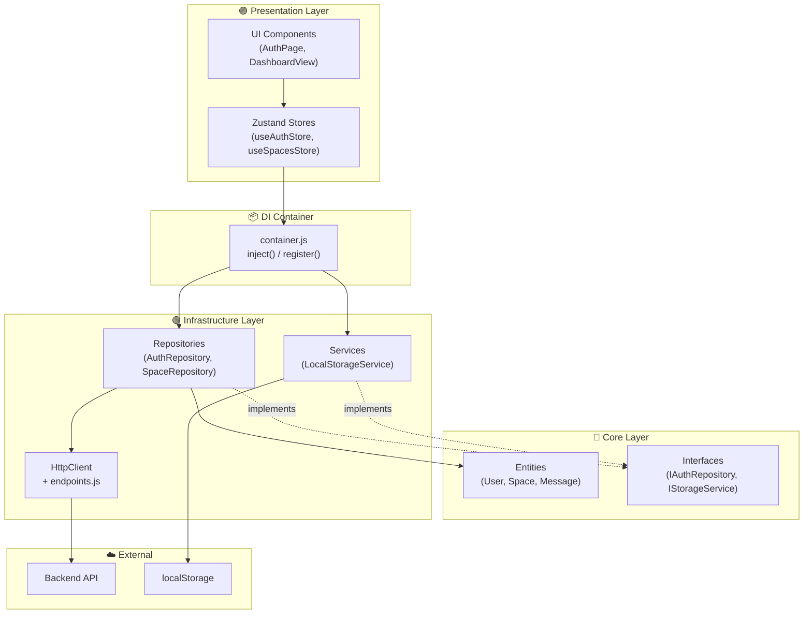
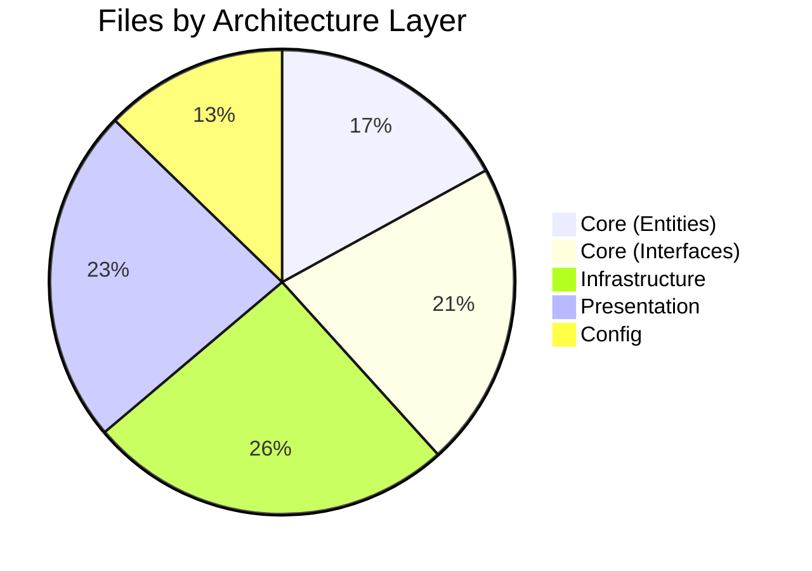
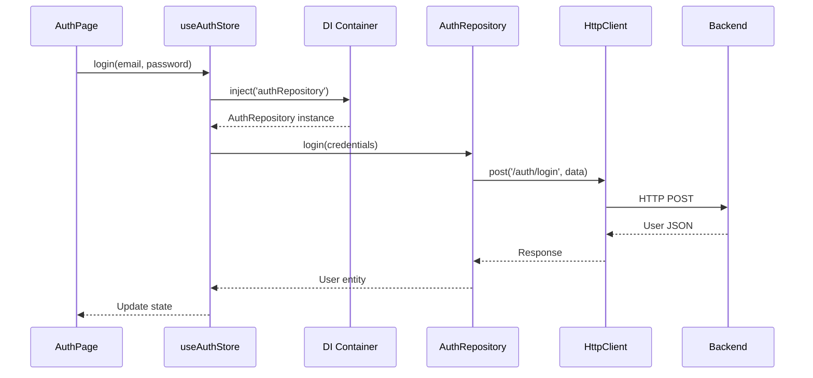

# Clean Architecture Overview

This document provides a visual overview of the Clean Architecture implementation.

## Dependency Flow

## Layer Responsibilities

| Layer | Responsibility | Can Depend On |
|-------|----------------|---------------|
| **Core** | Business logic, entities, interfaces | Nothing (innermost) |
| **Infrastructure** | API calls, storage, external services | Core |
| **Presentation** | UI, state management | Core, Infrastructure (via DI) |

## File Count by Layer

## Request Flow Example: Login

## Benefits

1. **Testability**: Mock repositories for unit tests
2. **Flexibility**: Swap implementations without changing business logic
3. **Maintainability**: Clear separation of concerns
4. **Scalability**: Add features without touching existing code
