# Activity Diagrams

## Activity Diagram Notation

| Symbol | Meaning |
|--------|---------|
| `([*])` | Initial/Final State |
| `[ ]` | Action/Activity |
| `{ }` | Decision/Branch |
| `-->` | Transition |
| `fork` | Parallel Split |
| `join` | Parallel Join |

---

## UC-01: Authenticate

### UC-01.1: Register Account

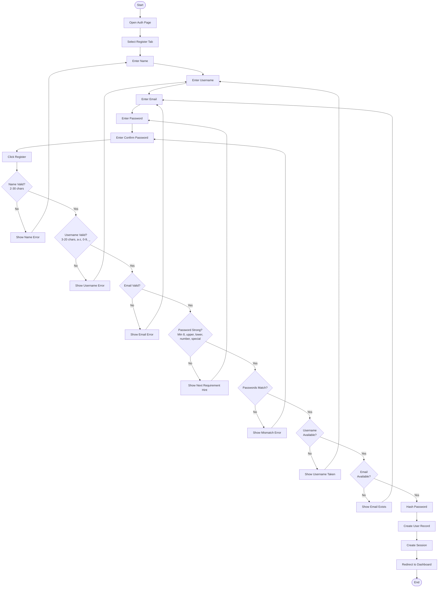

### UC-01.2: Login

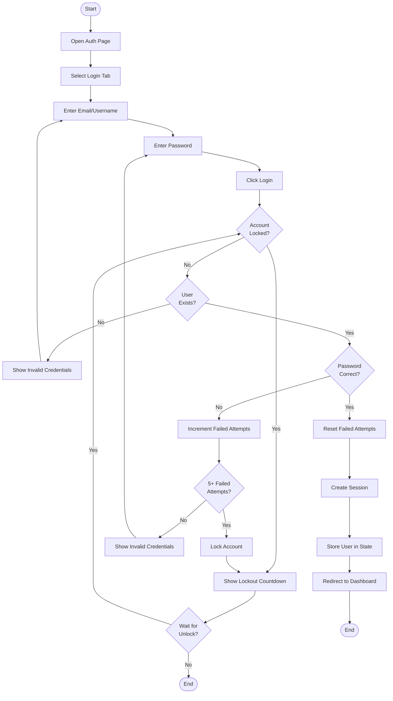

### UC-01.3: Logout

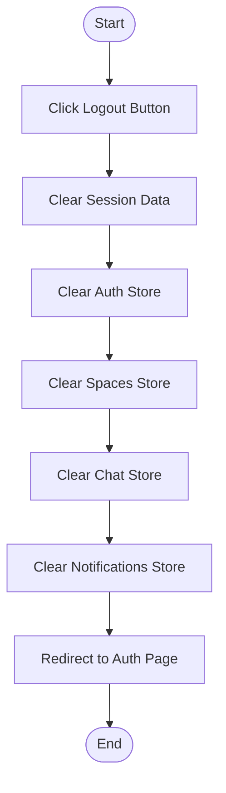

---

## UC-02: Manage Profile

### UC-02.1: Edit Profile Info

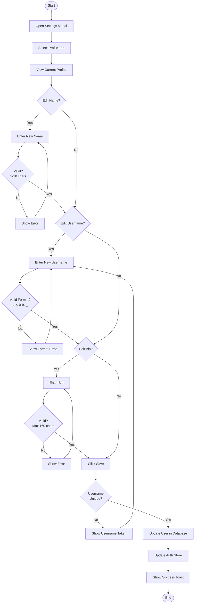

### UC-02.2: Upload Avatar

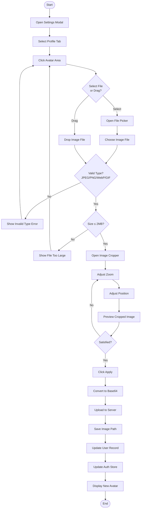

### UC-02.3: Configure Privacy

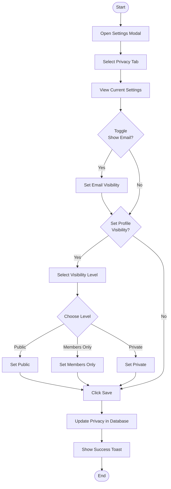

### UC-02.4: Delete Account

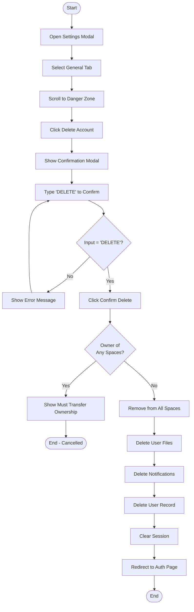

### UC-02.5: View Other Profile

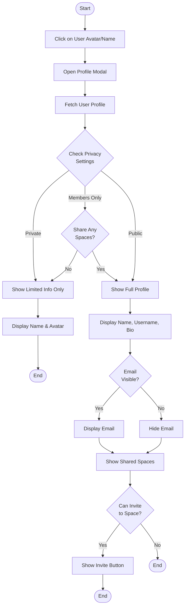

---

## UC-03: Manage Space Lifecycle

### UC-03.1: Create Space

```mermaid
flowchart TD
    Start([Start]) --> ClickCreate[Click Create Space Button]
    ClickCreate --> OpenModal[Open Create Space Modal]
    OpenModal --> Step1[Step 1: Basic Info]
    
    Step1 --> EnterName[Enter Space Name]
    EnterName --> EnterDesc[Enter Description]
    EnterDesc --> SelectCategory[Select Category]
    SelectCategory --> ClickNext1[Click Next]
    
    ClickNext1 --> ValidateName{Name Valid?\nRequired, max 100}
    ValidateName -->|No| ShowNameError[Show Error]
    ShowNameError --> EnterName
    ValidateName -->|Yes| Step2[Step 2: Settings]
    
    Step2 --> SelectVisibility{Select Visibility}
    SelectVisibility -->|Public| SetPublic[Set Public]
    SelectVisibility -->|Private| SetPrivate[Set Private]
    SetPublic --> ClickNext2[Click Next]
    SetPrivate --> ClickNext2
    
    ClickNext2 --> Step3[Step 3: Appearance]
    Step3 --> UploadThumbnail{Upload\nThumbnail?}
    UploadThumbnail -->|Yes| SelectImage[Select Image]
    SelectImage --> CropImage[Crop Image]
    CropImage --> ClickCreate2
    UploadThumbnail -->|No| ClickCreate2[Click Create]
    
    ClickCreate2 --> CreateSpace[Create Space Record]
    CreateSpace --> AddOwner[Add Creator as Owner]
    AddOwner --> CreateChannel[Create Default Channel]
    CreateChannel --> GenerateLink[Generate Invite Link]
    GenerateLink --> ShowSuccess[Show Success]
    ShowSuccess --> DisplayLink[Display Invite Link]
    DisplayLink --> CopyLink{Copy Link?}
    CopyLink -->|Yes| CopyToClipboard[Copy to Clipboard]
    CopyLink -->|No| CloseModal[Close Modal]
    CopyToClipboard --> CloseModal
    CloseModal --> End([End])
```

### UC-03.2: Update Space Settings

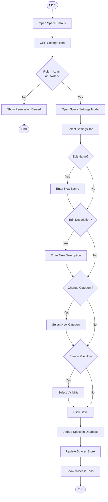

### UC-03.3: Delete Space

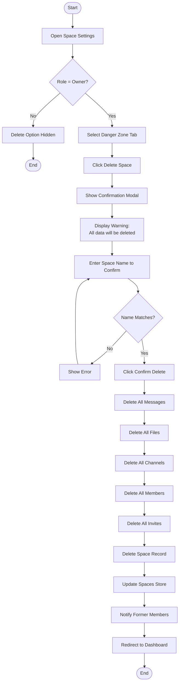

### UC-03.4: Search Public Spaces

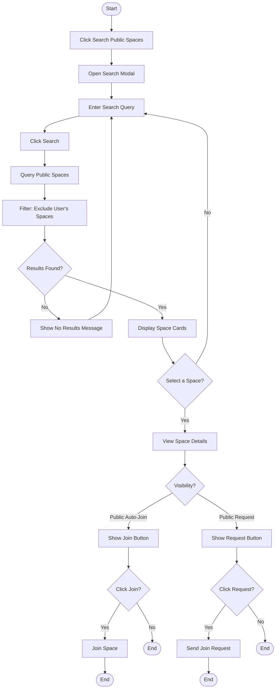

---

## UC-04: Manage Membership

### UC-04.1: Invite User

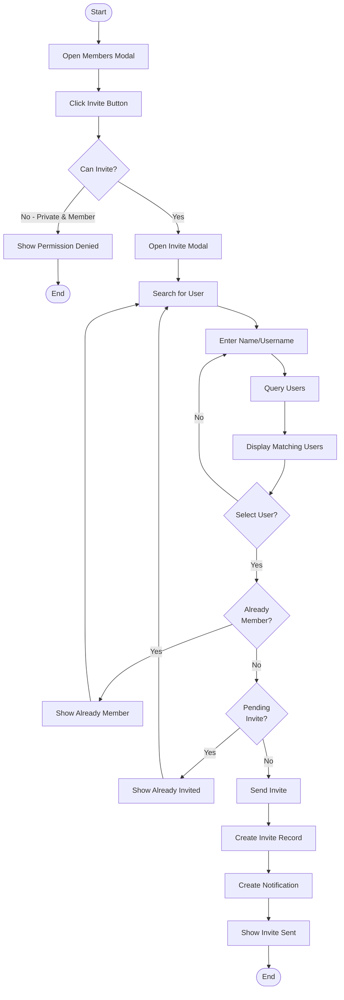

### UC-04.2: Generate Invite Link

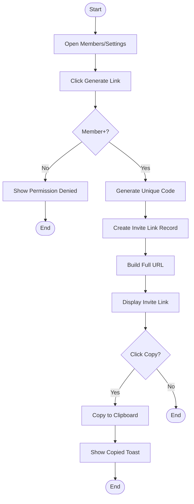

### UC-04.3: Join via Link

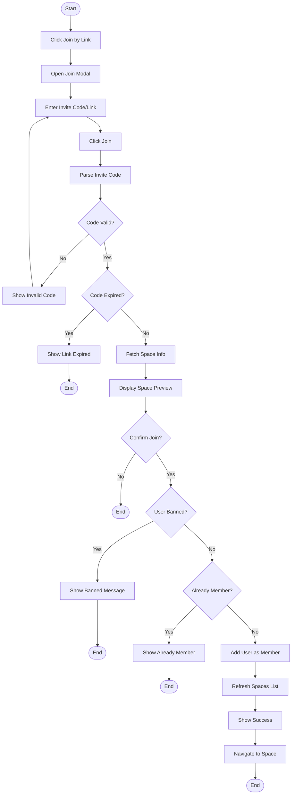

### UC-04.4: Request to Join

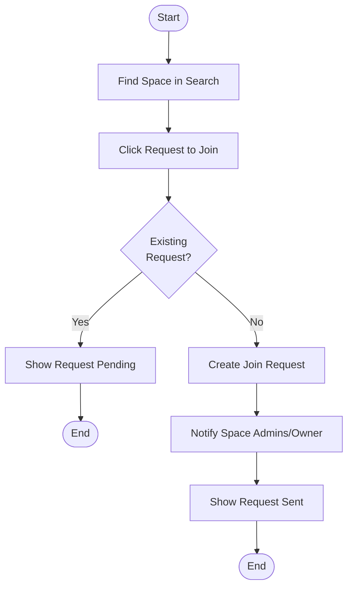

### UC-04.5: Approve/Reject Request

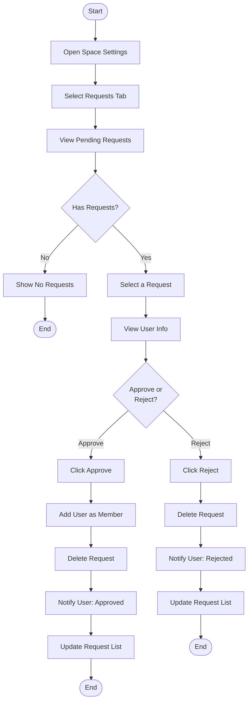

### UC-04.6: Remove Member (Kick)

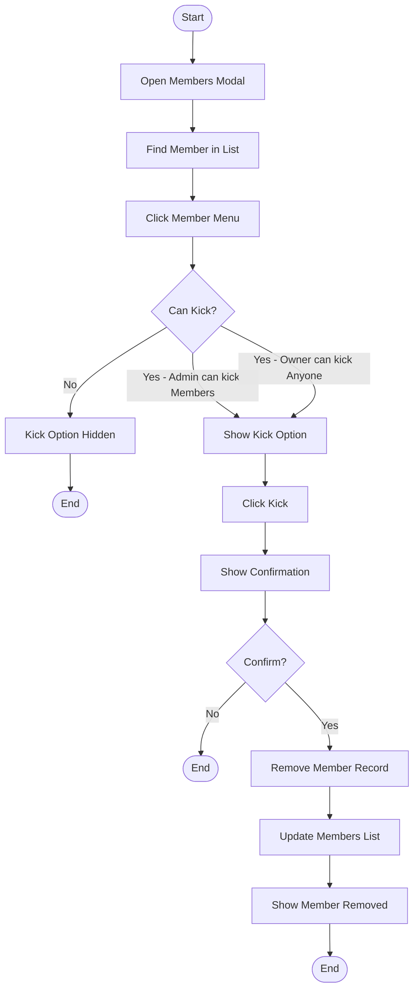

### UC-04.7: Ban Member

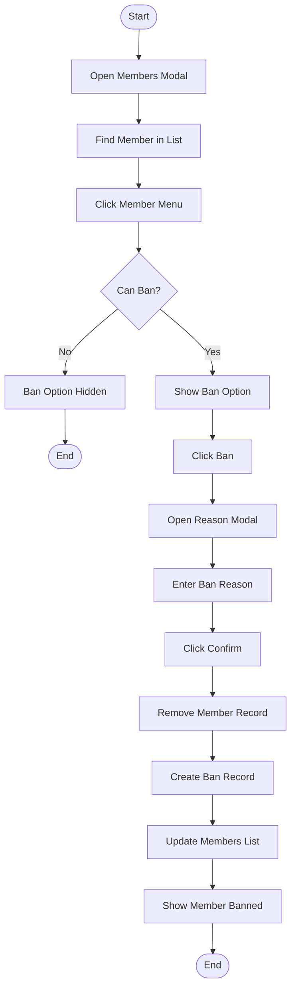

### UC-04.8: Leave Space

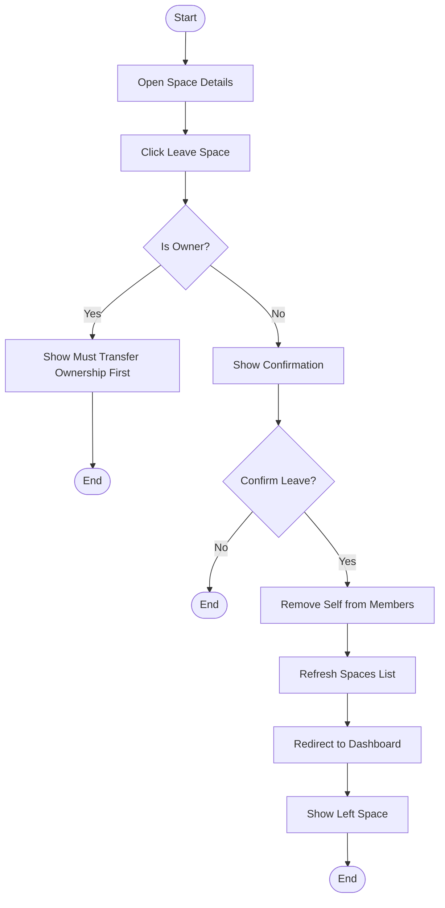

---

## UC-05: Manage Roles & Ownership

### UC-05.1: Change Member Role

```mermaid
flowchart TD
    Start([Start]) --> OpenMembers[Open Members Modal]
    OpenMembers --> FindMember[Find Member in List]
    FindMember --> ClickMenu[Click Member Menu]
    ClickMenu --> CheckPermission{Can Change Role?}
    
    CheckPermission -->|No - Member| HideOption[Role Options Hidden]
    HideOption --> End1([End])
    
    CheckPermission -->|Admin - Limited| ShowLimited[Show: Promote to Admin only for Members]
    CheckPermission -->|Owner - Full| ShowFull[Show All Role Options]
    
    ShowLimited --> SelectRole{Select New Role}
    ShowFull --> SelectRole
    
    SelectRole -->|Member| SetMember[Set Role = Member]
    SelectRole -->|Admin| SetAdmin[Set Role = Admin]
    
    SetMember --> ValidateChange{Valid Change?}
    SetAdmin --> ValidateChange
    
    ValidateChange -->|No - Cannot demote self| ShowError[Show Error]
    ShowError --> End2([End])
    
    ValidateChange -->|Yes| UpdateRole[Update Member Role]
    UpdateRole --> UpdateList[Update Members List]
    UpdateList --> ShowSuccess[Show Role Changed]
    ShowSuccess --> End3([End])
```

### UC-05.2: Transfer Ownership

```mermaid
flowchart TD
    Start([Start]) --> OpenSettings[Open Space Settings]
    OpenSettings --> CheckOwner{Is Owner?}
    
    CheckOwner -->|No| HideOption[Transfer Option Hidden]
    HideOption --> End1([End])
    
    CheckOwner -->|Yes| SelectDanger[Select Danger Zone Tab]
    SelectDanger --> ClickTransfer[Click Transfer Ownership]
    ClickTransfer --> OpenModal[Open Transfer Modal]
    OpenModal --> DisplayMembers[Display Space Members]
    
    DisplayMembers --> SelectNewOwner[Select New Owner]
    SelectNewOwner --> ShowConfirm[Show Confirmation Warning]
    ShowConfirm --> Confirm{Confirm Transfer?}
    
    Confirm -->|No| End2([End])
    Confirm -->|Yes| UpdateSpaceOwner[Update Space Owner ID]
    UpdateSpaceOwner --> SetNewOwnerRole[Set New Owner Role = Owner]
    SetNewOwnerRole --> DemoteOldOwner[Set Old Owner Role = Admin]
    DemoteOldOwner --> UpdateStore[Update Stores]
    UpdateStore --> ShowSuccess[Show Ownership Transferred]
    ShowSuccess --> End3([End])
```

---

## UC-06: Collaborate in Chat

### UC-06.1: Send Message

```mermaid
flowchart TD
    Start([Start]) --> OpenChat[Open Chat View]
    OpenChat --> SelectChannel[Select Channel]
    SelectChannel --> TypeMessage[Type Message in Input]
    TypeMessage --> ClickSend{Send?}
    
    ClickSend -->|Press Enter| ValidateMessage{Message\nNot Empty?}
    ClickSend -->|Click Button| ValidateMessage
    
    ValidateMessage -->|No| End1([End])
    ValidateMessage -->|Yes| ParseMentions[Parse @mentions]
    ParseMentions --> CreateMessage[Create Message Object]
    CreateMessage --> SendToServer[Send to Server]
    SendToServer --> StoreMessage[Store in Database]
    StoreMessage --> CreateNotifications{Has Mentions?}
    
    CreateNotifications -->|Yes| NotifyMentioned[Create Mention Notifications]
    NotifyMentioned --> AddToList
    CreateNotifications -->|No| AddToList[Add to Messages List]
    
    AddToList --> ClearInput[Clear Input Field]
    ClearInput --> ScrollToBottom[Scroll to Bottom]
    ScrollToBottom --> End2([End])
```

### UC-06.2: Reply to Message

```mermaid
flowchart TD
    Start([Start]) --> FindMessage[Find Message in Chat]
    FindMessage --> ClickReply[Click Reply Button]
    ClickReply --> SetReplyingTo[Set Replying To State]
    SetReplyingTo --> ShowPreview[Show Reply Preview Above Input]
    ShowPreview --> TypeReply[Type Reply Text]
    TypeReply --> SendReply[Send Message]
    
    SendReply --> CreateMessage[Create Message with replyToId]
    CreateMessage --> StoreMessage[Store in Database]
    StoreMessage --> ClearReplyingTo[Clear Replying To State]
    ClearReplyingTo --> HidePreview[Hide Reply Preview]
    HidePreview --> AddToList[Add to Messages List]
    AddToList --> End([End])
```

### UC-06.3: Forward Message

```mermaid
flowchart TD
    Start([Start]) --> FindMessage[Find Message in Chat]
    FindMessage --> ClickForward[Click Forward Button]
    ClickForward --> OpenModal[Open Channel Select Modal]
    OpenModal --> DisplayChannels[Display Available Channels]
    
    DisplayChannels --> SelectChannel{Select Channel?}
    SelectChannel -->|No| Cancel[Cancel]
    Cancel --> End1([End])
    
    SelectChannel -->|Yes| ConfirmForward[Confirm Forward]
    ConfirmForward --> CreateForward[Create Forwarded Message]
    CreateForward --> SetForwardedFrom[Set forwardedFromChannel]
    SetForwardedFrom --> StoreMessage[Store in Target Channel]
    StoreMessage --> ShowSuccess[Show Message Forwarded]
    ShowSuccess --> End2([End])
```

### UC-06.4: Edit Message

```mermaid
flowchart TD
    Start([Start]) --> FindMessage[Find Own Message]
    FindMessage --> ClickEdit[Click Edit Button]
    ClickEdit --> EnterEditMode[Enter Edit Mode]
    EnterEditMode --> ShowEditInput[Show Editable Text]
    ShowEditInput --> ModifyText[Modify Message Text]
    
    ModifyText --> SaveOrCancel{Save or Cancel?}
    SaveOrCancel -->|Cancel| ExitEditMode[Exit Edit Mode]
    ExitEditMode --> RestoreOriginal[Restore Original Text]
    RestoreOriginal --> End1([End])
    
    SaveOrCancel -->|Save| ValidateText{Text Not Empty?}
    ValidateText -->|No| ShowError[Show Error]
    ShowError --> ModifyText
    
    ValidateText -->|Yes| UpdateMessage[Update Message in Database]
    UpdateMessage --> SetEdited[Set Edited Flag]
    SetEdited --> UpdateList[Update Messages List]
    UpdateList --> ExitEditMode2[Exit Edit Mode]
    ExitEditMode2 --> End2([End])
```

### UC-06.5: Delete Message

```mermaid
flowchart TD
    Start([Start]) --> FindMessage[Find Message]
    FindMessage --> CheckPermission{Own Message\nor Admin/Owner?}
    
    CheckPermission -->|No| HideDelete[Delete Hidden]
    HideDelete --> End1([End])
    
    CheckPermission -->|Yes| ClickDelete[Click Delete]
    ClickDelete --> ShowConfirm[Show Confirmation]
    ShowConfirm --> Confirm{Confirm?}
    
    Confirm -->|No| End2([End])
    Confirm -->|Yes| SoftDelete[Soft Delete Message]
    SoftDelete --> SetDeletedAt[Set deletedAt Timestamp]
    SetDeletedAt --> SetDeletedBy[Set deletedBy User ID]
    SetDeletedBy --> UpdateList[Update Messages List]
    UpdateList --> ShowDeleted[Show 'Message Deleted' Placeholder]
    ShowDeleted --> End3([End])
```

### UC-06.6: Mention User

```mermaid
flowchart TD
    Start([Start]) --> TypeAt[Type '@' Character]
    TypeAt --> ShowPopup[Show Mention Popup]
    ShowPopup --> DisplayMembers[Display Space Members]
    
    DisplayMembers --> TypeMore{Continue Typing?}
    TypeMore -->|Yes| FilterList[Filter Members by Input]
    FilterList --> DisplayMembers
    
    TypeMore -->|No - Select| SelectMember[Select Member from List]
    SelectMember --> InsertMention[Insert @username in Input]
    InsertMention --> HidePopup[Hide Popup]
    HidePopup --> ContinueTyping[Continue Typing Message]
    ContinueTyping --> SendMessage[Send Message]
    
    SendMessage --> ParseMentions[Parse @mentions from Text]
    ParseMentions --> StoreMentions[Store Mention User IDs]
    StoreMentions --> CreateNotifications[Create Mention Notifications]
    CreateNotifications --> End([End])
```

---

## UC-07: Manage Files

### UC-07.1: Upload File

```mermaid
flowchart TD
    Start([Start]) --> OpenFiles[Open Files Modal]
    OpenFiles --> ClickUpload[Click Upload Button]
    ClickUpload --> SelectFiles[Select File(s)]
    
    SelectFiles --> ValidateSize{Size ≤ 50MB?}
    ValidateSize -->|No| ShowSizeError[Show File Too Large]
    ShowSizeError --> SelectFiles
    
    ValidateSize -->|Yes| StartUpload[Start Upload]
    StartUpload --> ShowProgress[Show Progress Bar]
    ShowProgress --> UpdateProgress[Update Progress %]
    
    UpdateProgress --> Complete{Upload\nComplete?}
    Complete -->|No| UpdateProgress
    Complete -->|Yes| StoreMetadata[Store File Metadata]
    StoreMetadata --> AddToList[Add to File List]
    AddToList --> ShowSuccess[Show Upload Complete]
    ShowSuccess --> End([End])
```

### UC-07.2: Create Folder

```mermaid
flowchart TD
    Start([Start]) --> OpenFiles[Open Files Modal]
    OpenFiles --> ClickNewFolder[Click New Folder]
    ClickNewFolder --> OpenInput[Open Folder Name Input]
    OpenInput --> EnterName[Enter Folder Name]
    EnterName --> ClickCreate[Click Create]
    
    ClickCreate --> ValidateName{Name Valid?}
    ValidateName -->|No| ShowError[Show Error]
    ShowError --> EnterName
    
    ValidateName -->|Yes| CheckDuplicate{Name Exists\nin Current Folder?}
    CheckDuplicate -->|Yes| ShowDuplicate[Show Duplicate Name Error]
    ShowDuplicate --> EnterName
    
    CheckDuplicate -->|No| CreateFolder[Create Folder Record]
    CreateFolder --> AddToList[Add to Folder List]
    AddToList --> ShowSuccess[Show Folder Created]
    ShowSuccess --> End([End])
```

### UC-07.3: Navigate Folders

```mermaid
flowchart TD
    Start([Start]) --> OpenFiles[Open Files Modal]
    OpenFiles --> ViewRoot[View Root Folder]
    ViewRoot --> DisplayContents[Display Files & Folders]
    
    DisplayContents --> ClickItem{Click Item?}
    ClickItem -->|File| PreviewFile[Open File Preview]
    PreviewFile --> DisplayContents
    
    ClickItem -->|Folder| EnterFolder[Enter Folder]
    EnterFolder --> UpdateBreadcrumb[Update Breadcrumb]
    UpdateBreadcrumb --> FetchContents[Fetch Folder Contents]
    FetchContents --> DisplayContents
    
    ClickItem -->|Breadcrumb| GoToFolder[Go to Selected Level]
    GoToFolder --> FetchContents
    
    ClickItem -->|Back| GoBack{Has Parent?}
    GoBack -->|No| DisplayContents
    GoBack -->|Yes| GoParent[Go to Parent Folder]
    GoParent --> FetchContents
```

### UC-07.4: Delete File/Folder

```mermaid
flowchart TD
    Start([Start]) --> SelectItem[Select File/Folder]
    SelectItem --> ClickDelete[Click Delete]
    ClickDelete --> CheckPermission{Own Item\nor Admin/Owner?}
    
    CheckPermission -->|No| ShowError[Show Permission Denied]
    ShowError --> End1([End])
    
    CheckPermission -->|Yes| CheckFolder{Is Folder?}
    CheckFolder -->|Yes| CheckEmpty{Folder Empty?}
    CheckEmpty -->|No| ShowNotEmpty[Show Folder Not Empty]
    ShowNotEmpty --> End2([End])
    
    CheckEmpty -->|Yes| ShowConfirm
    CheckFolder -->|No - File| ShowConfirm[Show Confirmation]
    
    ShowConfirm --> Confirm{Confirm?}
    Confirm -->|No| End3([End])
    Confirm -->|Yes| DeleteRecord[Delete Database Record]
    DeleteRecord --> DeletePhysical{Is File?}
    DeletePhysical -->|Yes| DeleteFile[Delete Physical File]
    DeleteFile --> UpdateList
    DeletePhysical -->|No| UpdateList[Update File/Folder List]
    UpdateList --> ShowSuccess[Show Deleted]
    ShowSuccess --> End4([End])
```

### UC-07.5: Move/Copy Files

```mermaid
flowchart TD
    Start([Start]) --> SelectFiles[Select File(s)]
    SelectFiles --> ClickAction{Move or Copy?}
    
    ClickAction -->|Move| ClickMove[Click Move]
    ClickAction -->|Copy| ClickCopy[Click Copy]
    
    ClickMove --> OpenFolderSelect[Open Folder Selection]
    ClickCopy --> OpenFolderSelect
    
    OpenFolderSelect --> DisplayFolders[Display Available Folders]
    DisplayFolders --> SelectTarget[Select Target Folder]
    SelectTarget --> ClickConfirm[Click Confirm]
    
    ClickConfirm --> CheckDuplicates{Duplicate Names\nin Target?}
    CheckDuplicates -->|Yes| HandleDuplicates[Rename with (1), (2), etc.]
    HandleDuplicates --> ProcessFiles
    CheckDuplicates -->|No| ProcessFiles{Move or Copy?}
    
    ProcessFiles -->|Move| UpdateReferences[Update File Folder IDs]
    ProcessFiles -->|Copy| CreateCopies[Create File Copies]
    CreateCopies --> CopyPhysical[Copy Physical Files]
    CopyPhysical --> RefreshList
    
    UpdateReferences --> RefreshList[Refresh File List]
    RefreshList --> ShowSuccess[Show Operation Complete]
    ShowSuccess --> End([End])
```

### UC-07.6: Preview File

```mermaid
flowchart TD
    Start([Start]) --> ClickFile[Click on File]
    ClickFile --> OpenPreview[Open Preview Modal]
    OpenPreview --> DetectType{Detect File Type}
    
    DetectType -->|Image| RenderImage[Render Image Tag]
    DetectType -->|PDF| RenderPDF[Render PDF in iFrame]
    DetectType -->|Video| RenderVideo[Render Video Player]
    DetectType -->|Audio| RenderAudio[Render Audio Player]
    DetectType -->|Other| ShowInfo[Show File Info Only]
    
    RenderImage --> DisplayPreview[Display Preview]
    RenderPDF --> DisplayPreview
    RenderVideo --> DisplayPreview
    RenderAudio --> DisplayPreview
    ShowInfo --> DisplayPreview
    
    DisplayPreview --> UserAction{User Action?}
    UserAction -->|Download| DownloadFile[Download File]
    UserAction -->|Close| ClosePreview[Close Preview]
    
    DownloadFile --> End1([End])
    ClosePreview --> End2([End])
```

---

## UC-08: View & Act on Notifications

### UC-08.1: View Notifications

```mermaid
flowchart TD
    Start([Start]) --> ClickBell[Click Notification Bell]
    ClickBell --> OpenPanel[Open Notifications Panel]
    OpenPanel --> FetchNotifications[Fetch User Notifications]
    FetchNotifications --> SortByDate[Sort by Date Descending]
    SortByDate --> DisplayList[Display Notification List]
    
    DisplayList --> HasUnread{Has Unread?}
    HasUnread -->|Yes| ShowBadge[Show Unread Count Badge]
    HasUnread -->|No| HideBadge[Hide Badge]
    
    ShowBadge --> WaitAction{User Action?}
    HideBadge --> WaitAction
    
    WaitAction -->|Click Notification| HandleClick[Handle Notification Type]
    WaitAction -->|Close Panel| End([End])
    
    HandleClick --> CheckType{Notification Type?}
    CheckType -->|Invite| ShowInviteActions[Show Accept/Decline]
    CheckType -->|Mention| NavigateToMessage[Navigate to Message]
    CheckType -->|System| MarkRead[Mark as Read]
    
    ShowInviteActions --> End
    NavigateToMessage --> End
    MarkRead --> End
```

### UC-08.2: Accept Invite

```mermaid
flowchart TD
    Start([Start]) --> FindInvite[Find Invite Notification]
    FindInvite --> ClickAccept[Click Accept]
    ClickAccept --> UpdateInvite[Update Invite Status = Accepted]
    UpdateInvite --> AddMember[Add User to Space Members]
    AddMember --> MarkRead[Mark Notification as Read]
    MarkRead --> RefreshSpaces[Refresh Spaces List]
    RefreshSpaces --> ShowSuccess[Show Joined Space Toast]
    ShowSuccess --> End([End])
```

### UC-08.3: Decline Invite

```mermaid
flowchart TD
    Start([Start]) --> FindInvite[Find Invite Notification]
    FindInvite --> ClickDecline[Click Decline]
    ClickDecline --> UpdateInvite[Update Invite Status = Declined]
    UpdateInvite --> MarkRead[Mark Notification as Read]
    MarkRead --> UpdateList[Update Notifications List]
    UpdateList --> ShowDeclined[Show Invite Declined]
    ShowDeclined --> End([End])
```

### UC-08.4: Mark All as Read

```mermaid
flowchart TD
    Start([Start]) --> OpenNotifications[Open Notifications Panel]
    OpenNotifications --> ClickMarkAll[Click Mark All as Read]
    ClickMarkAll --> UpdateAll[Update All Notifications: read = true]
    UpdateAll --> ClearBadge[Clear Unread Count Badge]
    ClearBadge --> UpdateList[Update Notifications List UI]
    UpdateList --> End([End])
```

---

## UC-09: Favorite Spaces

### UC-09.1: Add to Favorites

```mermaid
flowchart TD
    Start([Start]) --> ViewSpace[View Space Card]
    ViewSpace --> ClickHeart[Click Heart Icon - Unfilled]
    ClickHeart --> SendRequest[Send Toggle Favorite Request]
    SendRequest --> CheckExists{Already\nFavorite?}
    
    CheckExists -->|No| CreateFavorite[Create Favorite Record]
    CreateFavorite --> UpdateStore[Add to Favorites in Store]
    UpdateStore --> FillHeart[Fill Heart Icon]
    FillHeart --> ShowToast[Show Added to Favorites]
    ShowToast --> End([End])
    
    CheckExists -->|Yes| End
```

### UC-09.2: Remove from Favorites

```mermaid
flowchart TD
    Start([Start]) --> ViewSpace[View Space Card]
    ViewSpace --> ClickHeart[Click Heart Icon - Filled]
    ClickHeart --> SendRequest[Send Toggle Favorite Request]
    SendRequest --> CheckExists{Is Favorite?}
    
    CheckExists -->|Yes| DeleteFavorite[Delete Favorite Record]
    DeleteFavorite --> UpdateStore[Remove from Favorites in Store]
    UpdateStore --> UnfillHeart[Unfill Heart Icon]
    UnfillHeart --> ShowToast[Show Removed from Favorites]
    ShowToast --> End([End])
    
    CheckExists -->|No| End
```

### UC-09.3: Filter by Favorites

```mermaid
flowchart TD
    Start([Start]) --> ViewDashboard[View Dashboard]
    ViewDashboard --> ClickFavoritesTab[Click Favorites Tab]
    ClickFavoritesTab --> SetActiveTab[Set Active Tab = Favorites]
    SetActiveTab --> FetchFavorites{Favorites\nLoaded?}
    
    FetchFavorites -->|No| LoadFavorites[Load User Favorites]
    LoadFavorites --> FilterSpaces
    FetchFavorites -->|Yes| FilterSpaces[Filter Spaces by Favorite IDs]
    
    FilterSpaces --> HasFavorites{Has Favorites?}
    HasFavorites -->|No| ShowEmpty[Show No Favorites Message]
    HasFavorites -->|Yes| DisplaySpaces[Display Favorite Spaces]
    
    ShowEmpty --> End1([End])
    DisplaySpaces --> End2([End])
```

---

## Activity Diagram Summary

| Use Case | Activity Diagrams |
|----------|-------------------|
| UC-01: Authenticate | Register, Login, Logout |
| UC-02: Manage Profile | Edit Info, Upload Avatar, Configure Privacy, Delete Account, View Other |
| UC-03: Manage Spaces | Create, Update Settings, Delete, Search Public |
| UC-04: Manage Membership | Invite User, Generate Link, Join via Link, Request, Approve/Reject, Kick, Ban, Leave |
| UC-05: Manage Roles | Change Role, Transfer Ownership |
| UC-06: Chat | Send, Reply, Forward, Edit, Delete, Mention |
| UC-07: Manage Files | Upload, Create Folder, Navigate, Delete, Move/Copy, Preview |
| UC-08: Notifications | View, Accept Invite, Decline Invite, Mark All Read |
| UC-09: Favorites | Add, Remove, Filter |

**Total Activity Diagrams: 35**
