# Class Diagrams by Use Case (Subsystem)

This document contains class diagrams organized by use case/subsystem, following UML object modeling principles. Each diagram shows the relevant **Entity**, **Boundary**, and **Control** objects involved in that feature.

---

## UC-01: Authenticate

**Description:** Register, login, and manage authentication to access the system

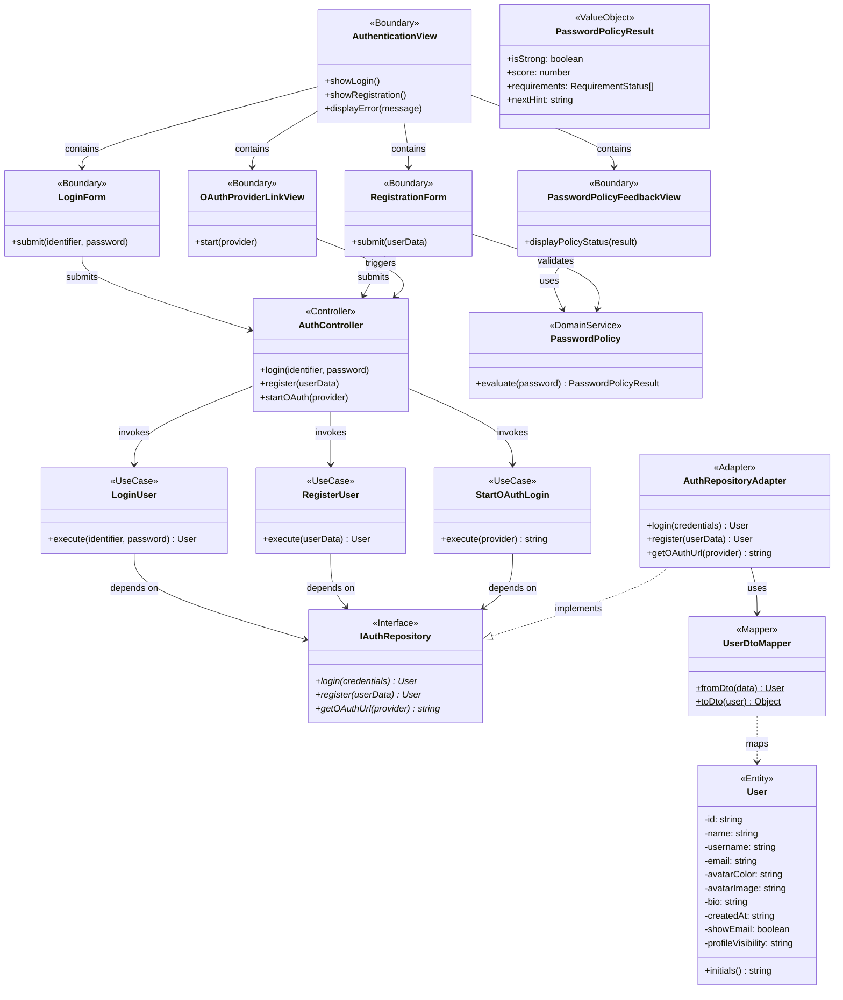

---

## UC-02: Manage Profile

**Description:** View and update personal profile information and privacy settings

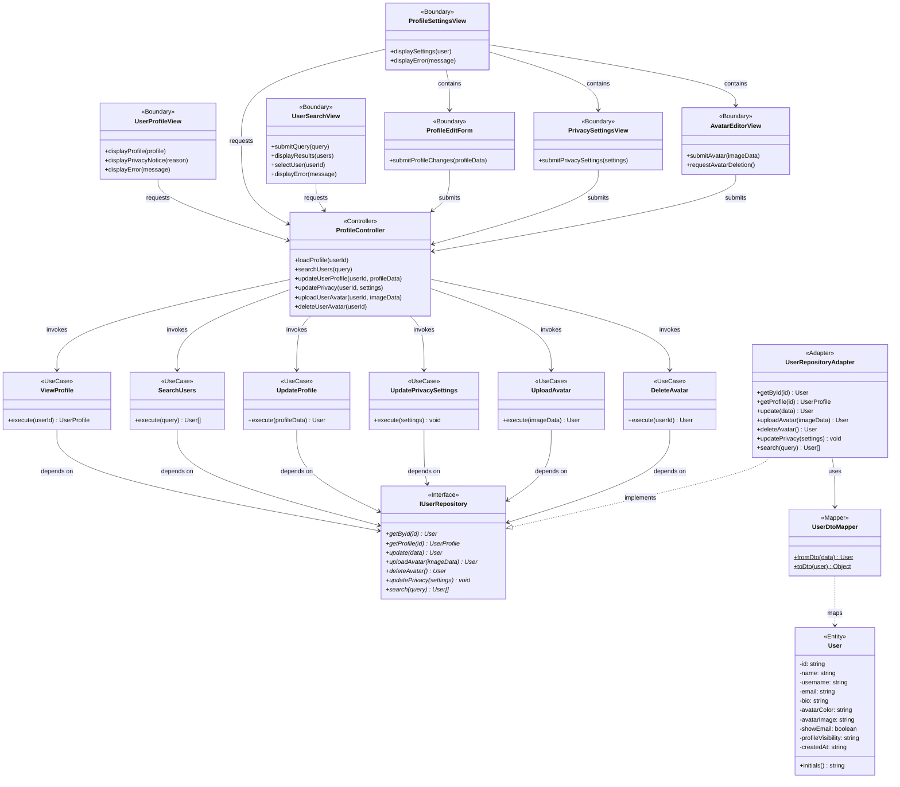

---

## UC-03: Manage Space Lifecycle

**Description:** Create, update, configure, and delete collaborative spaces

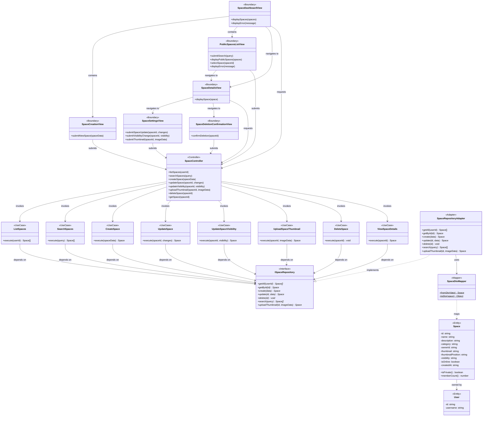

---

## UC-04: Manage Membership

**Description:** Handle space membership including invites, join requests, and leaving

```mermaid
---
config:
  layout: elk
---
classDiagram
    %% ==========================================
    %% BOUNDARY OBJECTS (Conceptual UI)
    %% ==========================================

    class MembershipView {
        <<Boundary>>
        +displayMembers(members)
        +displayJoinRequests(requests)
        +displayInviteLinks(invites)
        +displayError(message)
    }

    class JoinSpaceView {
        <<Boundary>>
        +requestJoin(spaceId, message)
    }

    class InviteManagementView {
        <<Boundary>>
        +generateInviteLink(spaceId)
        +revokeInviteLink(inviteId)
        +inviteUsers(spaceId, identifiers)
    }

    class JoinByInviteCodeView {
        <<Boundary>>
        +previewInvite(code)
        +joinByCode(code)
    }

    class JoinRequestModerationView {
        <<Boundary>>
        +approve(spaceId, requestId)
        +reject(spaceId, requestId)
    }

    class MemberAdministrationView {
        <<Boundary>>
        +removeMember(spaceId, memberId)
    }

    %% ==========================================
    %% INTERFACE ADAPTERS
    %% ==========================================

    class MembershipController {
        <<Controller>>
        +leaveSpace(spaceId)
        +requestToJoin(spaceId, message)
        +listMembers(spaceId)
        +removeMember(spaceId, memberId)
        +listJoinRequests(spaceId)
        +approveJoinRequest(spaceId, requestId)
        +rejectJoinRequest(spaceId, requestId)
        +generateInviteLink(spaceId)
        +revokeInviteLink(inviteId)
        +inviteUsers(spaceId, identifiers)
        +getInviteByCode(code)
        +joinByInviteCode(code)
    }

    %% ==========================================
    %% USE CASE INTERACTORS
    %% ==========================================

    class LeaveSpace {
        <<UseCase>>
        +execute(spaceId) void
    }

    class RequestJoinSpace {
        <<UseCase>>
        +execute(spaceId, message) JoinRequest
    }

    class ListMembers {
        <<UseCase>>
        +execute(spaceId) Member[]
    }

    class RemoveMember {
        <<UseCase>>
        +execute(spaceId, memberId) void
    }

    class ListJoinRequests {
        <<UseCase>>
        +execute(spaceId) JoinRequest[]
    }

    class ApproveJoinRequest {
        <<UseCase>>
        +execute(spaceId, requestId) void
    }

    class RejectJoinRequest {
        <<UseCase>>
        +execute(spaceId, requestId) void
    }

    class GenerateInviteLink {
        <<UseCase>>
        +execute(spaceId) Invite
    }

    class RevokeInviteLink {
        <<UseCase>>
        +execute(inviteId) void
    }

    class InviteUsersToSpace {
        <<UseCase>>
        +execute(spaceId, identifiers) void
    }

    class ViewInviteByCode {
        <<UseCase>>
        +execute(code) Invite
    }

    class JoinByInviteCode {
        <<UseCase>>
        +execute(code) void
    }

    %% ==========================================
    %% DOMAIN OBJECTS
    %% ==========================================

    class Member {
        <<Entity>>
        -id: string
        -userId: string
        -spaceId: string
        -role: string
        -joinedAt: string
        +isOwner() boolean
        +isAdmin() boolean
    }

    class JoinRequest {
        <<Entity>>
        -id: string
        -userId: string
        -spaceId: string
        -status: string
        -message: string
        -createdAt: string
    }

    class Invite {
        <<Entity>>
        -id: string
        -spaceId: string
        -inviterId: string
        -inviteeId: string
        -code: string
        -expiresAt: string
        -status: string
        +isExpired() boolean
    }

    class Space {
        <<Entity>>
        -id: string
        -name: string
        -visibility: string
        -requestsCount: number
    }

    class User {
        <<Entity>>
        -id: string
        -username: string
    }

    %% ==========================================
    %% PORTS & ADAPTERS
    %% ==========================================

    class IMemberRepository {
        <<Interface>>
        +getBySpace(spaceId)* Member[]
        +remove(spaceId, memberId)* void
        +leave(spaceId)* void
    }

    class IInviteRepository {
        <<Interface>>
        +getByCode(code)* Invite
        +createLink(spaceId)* Invite
        +revoke(inviteId)* void
        +inviteUsers(spaceId, identifiers)* void
        +getBySpace(spaceId)* Invite[]
    }

    class IJoinRequestRepository {
        <<Interface>>
        +getBySpace(spaceId)* JoinRequest[]
        +create(spaceId, message)* JoinRequest
        +approve(spaceId, requestId)* void
        +reject(spaceId, requestId)* void
    }

    class MemberRepositoryAdapter {
        <<Adapter>>
        +getBySpace(spaceId) Member[]
        +remove(spaceId, memberId) void
        +leave(spaceId) void
    }

    class InviteRepositoryAdapter {
        <<Adapter>>
        +getByCode(code) Invite
        +createLink(spaceId,) Invite
        +revoke(inviteId) void
        +inviteUsers(spaceId, identifiers) void
        +getBySpace(spaceId) Invite[]
    }

    class JoinRequestRepositoryAdapter {
        <<Adapter>>
        +getBySpace(spaceId) JoinRequest[]
        +create(spaceId, message) JoinRequest
        +approve(spaceId, requestId) void
        +reject(spaceId, requestId) void
    }

    %% ==========================================
    %% RELATIONSHIPS
    %% ==========================================

    MembershipView --> JoinSpaceView : contains
    MembershipView --> InviteManagementView : contains
    MembershipView --> JoinByInviteCodeView : contains
    MembershipView --> JoinRequestModerationView : contains
    MembershipView --> MemberAdministrationView : contains

    JoinSpaceView --> MembershipController : submits
    InviteManagementView --> MembershipController : submits
    JoinByInviteCodeView --> MembershipController : submits
    JoinRequestModerationView --> MembershipController : submits
    MemberAdministrationView --> MembershipController : submits

    MembershipController --> JoinSpace : invokes
    MembershipController --> LeaveSpace : invokes
    MembershipController --> RequestJoinSpace : invokes
    MembershipController --> ListMembers : invokes
    MembershipController --> RemoveMember : invokes
    MembershipController --> ListJoinRequests : invokes
    MembershipController --> ApproveJoinRequest : invokes
    MembershipController --> RejectJoinRequest : invokes
    MembershipController --> GenerateInviteLink : invokes
    MembershipController --> RevokeInviteLink : invokes
    MembershipController --> InviteUsersToSpace : invokes
    MembershipController --> ViewInviteByCode : invokes
    MembershipController --> JoinByInviteCode : invokes

    LeaveSpace --> IMemberRepository : depends on
    ListMembers --> IMemberRepository : depends on
    RemoveMember --> IMemberRepository : depends on

    RequestJoinSpace --> IJoinRequestRepository : depends on
    ListJoinRequests --> IJoinRequestRepository : depends on
    ApproveJoinRequest --> IJoinRequestRepository : depends on
    RejectJoinRequest --> IJoinRequestRepository : depends on

    GenerateInviteLink --> IInviteRepository : depends on
    RevokeInviteLink --> IInviteRepository : depends on
    InviteUsersToSpace --> IInviteRepository : depends on
    ViewInviteByCode --> IInviteRepository : depends on
    JoinByInviteCode --> IInviteRepository : depends on

    MemberRepositoryAdapter ..|> IMemberRepository : implements
    InviteRepositoryAdapter ..|> IInviteRepository : implements
    JoinRequestRepositoryAdapter ..|> IJoinRequestRepository : implements

    Member --> User : represents
    Member --> Space : belongs to
    JoinRequest --> User : from
    JoinRequest --> Space : to
    Invite --> Space : for
    Invite --> User : from inviter
```

---

## UC-05: Manage Roles & Ownership

**Description:** Assign roles, change permissions, and transfer space ownership

```mermaid
classDiagram
    %% ==========================================
    %% BOUNDARY OBJECTS (Conceptual UI)
    %% ==========================================

    class RoleManagementView {
        <<Boundary>>
        +displayMembers(members)
        +changeRole(memberId, role)
        +removeMember(memberId)
        +displayError(message)
    }

    class OwnershipTransferView {
        <<Boundary>>
        +transferOwnership(newOwnerId)
    }

    class BanManagementView {
        <<Boundary>>
        +banMember(memberId, reason)
        +unbanMember(banId)
        +displayBans(bans)
    }

    %% ==========================================
    %% INTERFACE ADAPTERS
    %% ==========================================

    class RoleOwnershipController {
        <<Controller>>
        +listMembers(spaceId)
        +changeMemberRole(spaceId, memberId, role, actorId)
        +removeMember(spaceId, memberId, actorId)
        +banMember(spaceId, memberId, actorId, reason)
        +listBans(spaceId)
        +unbanMember(spaceId, banId, actorId)
        +transferOwnership(spaceId, currentOwnerId, newOwnerId)
    }

    %% ==========================================
    %% USE CASE INTERACTORS
    %% ==========================================

    class ListSpaceMembers {
        <<UseCase>>
        +execute(spaceId) Member[]
    }

    class ChangeMemberRole {
        <<UseCase>>
        +execute(spaceId, memberId, role, actorId) void
    }

    class RemoveMember {
        <<UseCase>>
        +execute(spaceId, memberId, actorId) void
    }

    class BanMember {
        <<UseCase>>
        +execute(spaceId, memberId, actorId, reason) Ban
    }

    class ListBans {
        <<UseCase>>
        +execute(spaceId) Ban[]
    }

    class UnbanMember {
        <<UseCase>>
        +execute(spaceId, banId, actorId) void
    }

    class TransferSpaceOwnership {
        <<UseCase>>
        +execute(spaceId, currentOwnerId, newOwnerId) void
    }

    %% ==========================================
    %% DOMAIN OBJECTS
    %% ==========================================

    class Member {
        <<Entity>>
        -id: string
        -userId: string
        -spaceId: string
        -role: string
        -joinedAt: string
        +isOwner() boolean
        +isAdmin() boolean
        +isModerator() boolean
    }

    class Ban {
        <<Entity>>
        -id: string
        -userId: string
        -spaceId: string
        -bannedBy: string
        -reason: string
        -createdAt: string
    }

    class Space {
        <<Entity>>
        -id: string
        -name: string
        -ownerId: string
    }

    class User {
        <<Entity>>
        -id: string
        -username: string
    }

    %% ==========================================
    %% PORTS & ADAPTERS
    %% ==========================================

    class IMemberRepository {
        <<Interface>>
        +getBySpace(spaceId)* Member[]
        +updateRole(spaceId, memberId, role)* void
        +remove(spaceId, memberId)* void
        +ban(spaceId, memberId, bannedBy, reason)* Ban
    }

    class ISpaceRepository {
        <<Interface>>
        +transferOwnership(spaceId, currentOwnerId, newOwnerId)* void
        +getBans(spaceId)* Ban[]
        +unban(spaceId, banId)* void
    }

    class MemberRepositoryAdapter {
        <<Adapter>>
        +getBySpace(spaceId) Member[]
        +updateRole(spaceId, memberId, role) void
        +remove(spaceId, memberId) void
        +ban(spaceId, memberId, bannedBy, reason) Ban
    }

    class SpaceRepositoryAdapter {
        <<Adapter>>
        +transferOwnership(spaceId, currentOwnerId, newOwnerId) void
        +getBans(spaceId) Ban[]
        +unban(spaceId, banId) void
    }

    %% ==========================================
    %% RELATIONSHIPS
    %% ==========================================

    RoleManagementView --> OwnershipTransferView : navigates to
    RoleManagementView --> BanManagementView : navigates to

    RoleManagementView --> RoleOwnershipController : submits
    OwnershipTransferView --> RoleOwnershipController : submits
    BanManagementView --> RoleOwnershipController : submits

    RoleOwnershipController --> ListSpaceMembers : invokes
    RoleOwnershipController --> ChangeMemberRole : invokes
    RoleOwnershipController --> RemoveMember : invokes
    RoleOwnershipController --> BanMember : invokes
    RoleOwnershipController --> ListBans : invokes
    RoleOwnershipController --> UnbanMember : invokes
    RoleOwnershipController --> TransferSpaceOwnership : invokes

    ListSpaceMembers --> IMemberRepository : depends on
    ChangeMemberRole --> IMemberRepository : depends on
    RemoveMember --> IMemberRepository : depends on
    BanMember --> IMemberRepository : depends on

    ListBans --> ISpaceRepository : depends on
    UnbanMember --> ISpaceRepository : depends on
    TransferSpaceOwnership --> ISpaceRepository : depends on

    MemberRepositoryAdapter ..|> IMemberRepository : implements
    SpaceRepositoryAdapter ..|> ISpaceRepository : implements

    Member --> User : represents
    Member --> Space : belongs to
    Ban --> User : bans
    Ban --> Space : from
    Space --> User : owned by
```

---

## UC-06: Collaborate in Chat

**Description:** Send, reply, forward messages, mention users in space channels

```mermaid
classDiagram
    %% ==========================================
    %% BOUNDARY OBJECTS (Conceptual UI)
    %% ==========================================

    class ChatConversationView {
        <<Boundary>>
        +displayMessages(messages)
        +displayError(message)
    }

    class ChannelNavigationView {
        <<Boundary>>
        +selectChannel(channelId)
        +createChannel(name, description)
        +updateChannel(channelId, changes)
        +deleteChannel(channelId)
    }

    class MessageComposerView {
        <<Boundary>>
        +sendMessage(channelId, text, replyToId, attachments)
        +requestMentionSuggestions(query)
    }

    class MessageActionView {
        <<Boundary>>
        +deleteMessage(messageId)
        +forwardMessage(messageId, targetChannelId)
        +editMessage(messageId, newText)
    }

    class MentionSuggestionView {
        <<Boundary>>
        +displaySuggestions(members)
    }

    %% ==========================================
    %% INTERFACE ADAPTERS
    %% ==========================================

    class ChatController {
        <<Controller>>
        +listChannels(spaceId)
        +createChannel(spaceId, channelData)
        +updateChannel(channelId, changes)
        +deleteChannel(channelId)
        +listMessages(spaceId, channelId)
        +sendMessage(spaceId, channelId, messageData)
        +editMessage(messageId, newText, actorId)
        +deleteMessage(messageId, actorId)
        +forwardMessage(messageId, targetChannelId, actorId, spaceId)
        +suggestMentions(spaceId, query)
    }

    %% ==========================================
    %% USE CASE INTERACTORS
    %% ==========================================

    class ListChannels {
        <<UseCase>>
        +execute(spaceId) Channel[]
    }

    class CreateChannel {
        <<UseCase>>
        +execute(spaceId, channelData) Channel
    }

    class UpdateChannel {
        <<UseCase>>
        +execute(channelId, changes) Channel
    }

    class DeleteChannel {
        <<UseCase>>
        +execute(channelId) void
    }

    class ListMessages {
        <<UseCase>>
        +execute(spaceId, channelId) Message[]
    }

    class SendMessage {
        <<UseCase>>
        +execute(spaceId, channelId, messageData) Message
    }

    class EditMessage {
        <<UseCase>>
        +execute(messageId, newText, actorId) Message
    }

    class DeleteMessage {
        <<UseCase>>
        +execute(messageId, actorId) void
    }

    class ForwardMessage {
        <<UseCase>>
        +execute(messageId, targetChannelId, actorId, spaceId) void
    }

    class SuggestMentions {
        <<UseCase>>
        +execute(spaceId, query) Member[]
    }

    %% ==========================================
    %% DOMAIN OBJECTS
    %% ==========================================

    class Message {
        <<Entity>>
        -id: string
        -spaceId: string
        -channelId: string
        -senderId: string
        -text: string
        -type: string
        -mentions: array
        -replyToId: string
        -forwardedFromChannel: string
        -attachments: array
        -deletedAt: string
        -createdAt: string
        +isFromUser(userId) boolean
        +isDeleted() boolean
        +hasMentions() boolean
    }

    class Channel {
        <<Entity>>
        -id: string
        -spaceId: string
        -name: string
        -description: string
        -isDefault: boolean
        -createdAt: string
    }

    class Member {
        <<Entity>>
        -id: string
        -userId: string
        -username: string
        -avatarColor: string
    }

    class Space {
        <<Entity>>
        -id: string
        -name: string
    }

    %% ==========================================
    %% PORTS & ADAPTERS
    %% ==========================================

    class IChatRepository {
        <<Interface>>
        +getMessages(spaceId, channelId)* Message[]
        +sendMessage(spaceId, data)* Message
        +deleteMessage(messageId, senderId)* void
        +updateMessage(messageId, text, senderId)* Message
        +forwardMessage(messageId, targetChannelId, senderId, spaceId)* void
        +getChannels(spaceId)* Channel[]
        +createChannel(spaceId, data)* Channel
        +updateChannel(channelId, data)* Channel
        +deleteChannel(channelId)* void
    }

    class IMemberRepository {
        <<Interface>>
        +getBySpace(spaceId)* Member[]
        +searchMembers(spaceId, query)* Member[]
    }

    class ChatRepositoryAdapter {
        <<Adapter>>
        +getMessages(spaceId, channelId) Message[]
        +sendMessage(spaceId, data) Message
        +deleteMessage(messageId, senderId) void
        +updateMessage(messageId, text, senderId) Message
        +forwardMessage(messageId, targetChannelId, senderId, spaceId) void
        +getChannels(spaceId) Channel[]
        +createChannel(spaceId, data) Channel
        +updateChannel(channelId, data) Channel
        +deleteChannel(channelId) void
    }

    class MessageDtoMapper {
        <<Mapper>>
        +fromDto(data) Message$
    }

    class ChannelDtoMapper {
        <<Mapper>>
        +fromDto(data) Channel$
    }

    %% ==========================================
    %% RELATIONSHIPS
    %% ==========================================

    ChatConversationView --> ChannelNavigationView : contains
    ChatConversationView --> MessageComposerView : contains
    ChatConversationView --> MessageActionView : contains
    MessageComposerView --> MentionSuggestionView : contains

    ChannelNavigationView --> ChatController : submits
    MessageComposerView --> ChatController : submits
    MessageActionView --> ChatController : submits
    ChatConversationView --> ChatController : requests

    ChatController --> ListChannels : invokes
    ChatController --> CreateChannel : invokes
    ChatController --> UpdateChannel : invokes
    ChatController --> DeleteChannel : invokes
    ChatController --> ListMessages : invokes
    ChatController --> SendMessage : invokes
    ChatController --> EditMessage : invokes
    ChatController --> DeleteMessage : invokes
    ChatController --> ForwardMessage : invokes
    ChatController --> SuggestMentions : invokes

    ListChannels --> IChatRepository : depends on
    CreateChannel --> IChatRepository : depends on
    UpdateChannel --> IChatRepository : depends on
    DeleteChannel --> IChatRepository : depends on
    ListMessages --> IChatRepository : depends on
    SendMessage --> IChatRepository : depends on
    EditMessage --> IChatRepository : depends on
    DeleteMessage --> IChatRepository : depends on
    ForwardMessage --> IChatRepository : depends on

    SuggestMentions --> IMemberRepository : depends on

    ChatRepositoryAdapter ..|> IChatRepository : implements
    ChatRepositoryAdapter --> MessageDtoMapper : uses
    ChatRepositoryAdapter --> ChannelDtoMapper : uses

    Message --> Channel : belongs to
    Message --> Member : sent by
    Message "0..1" --> Message : replies to
    Channel --> Space : belongs to
```

---

## UC-07: Manage Files & Folders

**Description:** Upload, download, manage files and folders in space

```mermaid
classDiagram
    %% ==========================================
    %% BOUNDARY OBJECTS (Conceptual UI)
    %% ==========================================

    class FileBrowserView {
        <<Boundary>>
        +displayFolders(folders)
        +displayFiles(files)
        +displayError(message)
    }

    class FolderNavigationView {
        <<Boundary>>
        +openFolder(folderId)
        +navigateUp()
    }

    class FileUploadView {
        <<Boundary>>
        +upload(spaceId, folderId, fileData)
        +displayProgress(progress)
    }

    class FilePreviewView {
        <<Boundary>>
        +preview(fileId)
        +download(fileId)
    }

    class FileOrganizationView {
        <<Boundary>>
        +renameFile(fileId, name)
        +deleteFile(fileId)
        +moveFiles(fileIds, targetFolderId)
        +copyFiles(fileIds, targetFolderId)
        +createFolder(spaceId, parentFolderId, name)
        +renameFolder(folderId, name)
        +deleteFolder(folderId)
        +createLink(spaceId, folderId, name, url)
    }

    %% ==========================================
    %% INTERFACE ADAPTERS
    %% ==========================================

    class FileController {
        <<Controller>>
        +listFolderContents(spaceId, folderId)
        +uploadFile(spaceId, folderId, fileData, actorId)
        +downloadFile(fileId)
        +renameFile(fileId, name, actorId)
        +deleteFile(fileId, actorId)
        +moveFiles(fileIds, folderId, actorId)
        +copyFiles(fileIds, folderId, actorId)
        +createFolder(spaceId, parentId, name, actorId)
        +renameFolder(folderId, name, actorId)
        +deleteFolder(folderId, actorId)
        +createLink(spaceId, folderId, name, url, actorId)
    }

    %% ==========================================
    %% USE CASE INTERACTORS
    %% ==========================================

    class ListFolderContents {
        <<UseCase>>
        +execute(spaceId, folderId) FileSystemListing
    }

    class UploadFile {
        <<UseCase>>
        +execute(spaceId, folderId, fileData, actorId) File
    }

    class DownloadFile {
        <<UseCase>>
        +execute(fileId) string
    }

    class RenameFile {
        <<UseCase>>
        +execute(fileId, name, actorId) File
    }

    class DeleteFile {
        <<UseCase>>
        +execute(fileId, actorId) void
    }

    class MoveFiles {
        <<UseCase>>
        +execute(fileIds, folderId, actorId) void
    }

    class CopyFiles {
        <<UseCase>>
        +execute(fileIds, folderId, actorId) void
    }

    class CreateFolder {
        <<UseCase>>
        +execute(spaceId, parentId, name, actorId) Folder
    }

    class RenameFolder {
        <<UseCase>>
        +execute(folderId, name, actorId) Folder
    }

    class DeleteFolder {
        <<UseCase>>
        +execute(folderId, actorId) void
    }

    class CreateLink {
        <<UseCase>>
        +execute(spaceId, folderId, name, url, actorId) File
    }

    %% ==========================================
    %% DOMAIN OBJECTS
    %% ==========================================

    class File {
        <<Entity>>
        -id: string
        -spaceId: string
        -folderId: string
        -name: string
        -fileType: string
        -size: number
        -url: string
        -isLink: boolean
        -uploadedBy: string
        -uploaderUsername: string
        -thumbnailPosition: number
        -createdAt: string
        +isImage() boolean
        +isVideo() boolean
        +isPdf() boolean
    }

    class Folder {
        <<Entity>>
        -id: string
        -spaceId: string
        -parentId: string
        -name: string
        -createdBy: string
        -createdAt: string
    }

    class Space {
        <<Entity>>
        -id: string
        -name: string
    }

    class FileSystemListing {
        <<ValueObject>>
        +folders: Folder[]
        +files: File[]
    }

    %% ==========================================
    %% PORTS & ADAPTERS
    %% ==========================================

    class IFileRepository {
        <<Interface>>
        +list(spaceId, folderId)* FileSystemListing
        +upload(spaceId, folderId, fileData, actorId, onProgress)* File
        +delete(fileId, actorId)* void
        +rename(fileId, name, actorId)* File
        +move(fileIds, folderId, actorId)* void
        +copy(fileIds, folderId, actorId)* void
        +getDownloadUrl(fileId)* string
        +createFolder(spaceId, parentId, name, actorId)* Folder
        +renameFolder(folderId, name, actorId)* Folder
        +deleteFolder(folderId, actorId)* void
        +createLink(spaceId, folderId, name, url, actorId)* File
    }

    class FileRepositoryAdapter {
        <<Adapter>>
        +list(spaceId, folderId) FileSystemListing
        +upload(spaceId, folderId, fileData, actorId, onProgress) File
        +delete(fileId, actorId) void
        +rename(fileId, name, actorId) File
        +move(fileIds, folderId, actorId) void
        +copy(fileIds, folderId, actorId) void
        +getDownloadUrl(fileId) string
        +createFolder(spaceId, parentId, name, actorId) Folder
        +renameFolder(folderId, name, actorId) Folder
        +deleteFolder(folderId, actorId) void
        +createLink(spaceId, folderId, name, url, actorId) File
    }

    class FileDtoMapper {
        <<Mapper>>
        +fromDto(data) File$
        +toDto(file) Object$
    }

    class FolderDtoMapper {
        <<Mapper>>
        +fromDto(data) Folder$
        +toDto(folder) Object$
    }

    %% ==========================================
    %% RELATIONSHIPS
    %% ==========================================

    FileBrowserView --> FolderNavigationView : contains
    FileBrowserView --> FileUploadView : contains
    FileBrowserView --> FilePreviewView : contains
    FileBrowserView --> FileOrganizationView : contains

    FolderNavigationView --> FileController : submits
    FileUploadView --> FileController : submits
    FilePreviewView --> FileController : submits
    FileOrganizationView --> FileController : submits
    FileBrowserView --> FileController : requests

    FileController --> ListFolderContents : invokes
    FileController --> UploadFile : invokes
    FileController --> DownloadFile : invokes
    FileController --> RenameFile : invokes
    FileController --> DeleteFile : invokes
    FileController --> MoveFiles : invokes
    FileController --> CopyFiles : invokes
    FileController --> CreateFolder : invokes
    FileController --> RenameFolder : invokes
    FileController --> DeleteFolder : invokes
    FileController --> CreateLink : invokes

    ListFolderContents --> IFileRepository : depends on
    UploadFile --> IFileRepository : depends on
    DownloadFile --> IFileRepository : depends on
    RenameFile --> IFileRepository : depends on
    DeleteFile --> IFileRepository : depends on
    MoveFiles --> IFileRepository : depends on
    CopyFiles --> IFileRepository : depends on
    CreateFolder --> IFileRepository : depends on
    RenameFolder --> IFileRepository : depends on
    DeleteFolder --> IFileRepository : depends on
    CreateLink --> IFileRepository : depends on

    FileRepositoryAdapter ..|> IFileRepository : implements
    FileRepositoryAdapter --> FileDtoMapper : uses
    FileRepositoryAdapter --> FolderDtoMapper : uses

    File --> Folder : belongs to
    Folder --> Folder : nested in
    Folder --> Space : belongs to
```

---

## UC-08: View & Act on Notifications

**Description:** View notifications and respond to invites, mentions, and system alerts

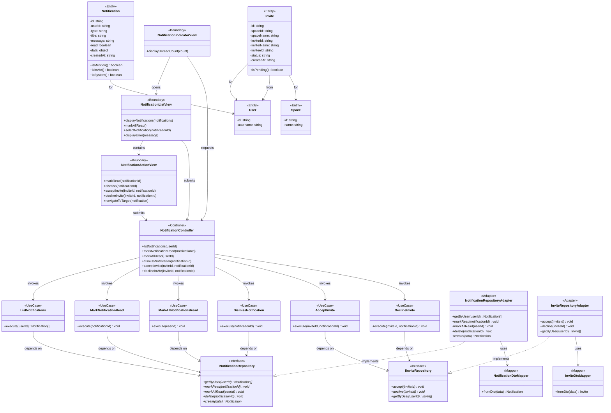

---

## UC-09: Favorite Spaces

**Description:** Mark/unmark spaces as favorites for quick access

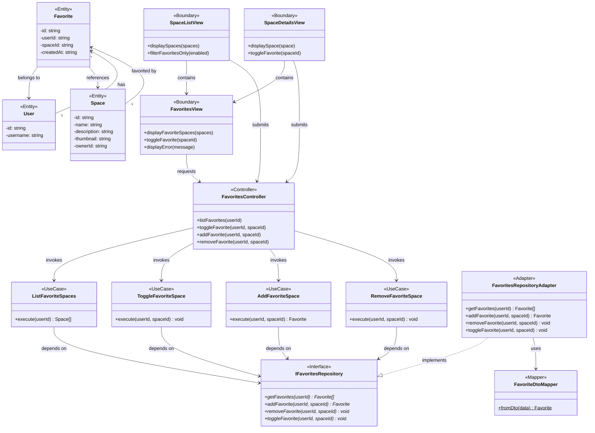

---

## Domain Layer - Entity Objects Class Diagram

This diagram shows all entity objects in the domain layer with their complete attributes, methods, and relationships.

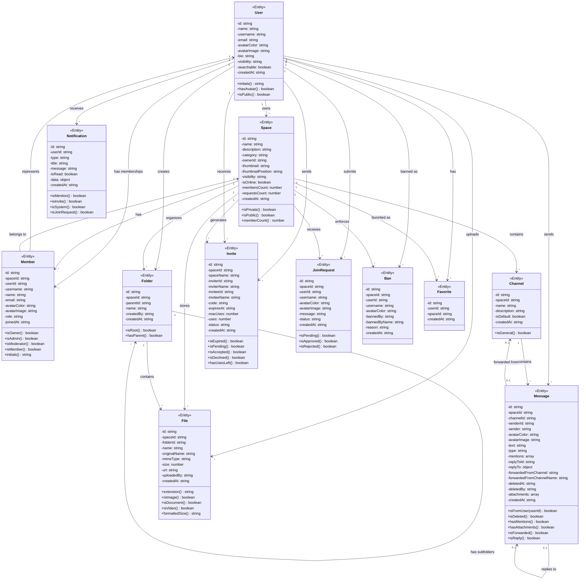

### Entity Relationships Summary

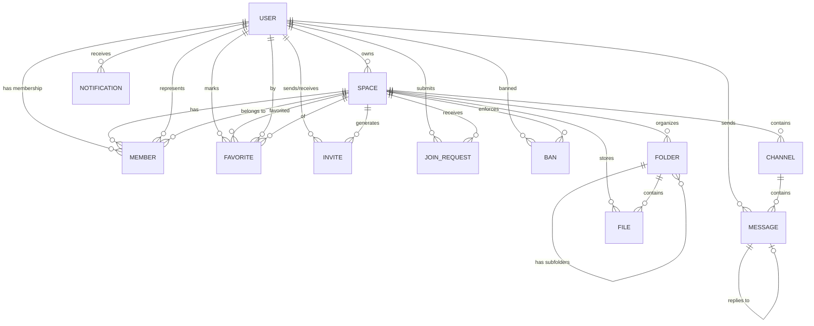

---

## Summary

| Use Case                       | Primary Entities            | Primary Boundaries                                                                                           | Primary Controllers / Use Cases                                                   |
| ------------------------------ | --------------------------- | ------------------------------------------------------------------------------------------------------------ | --------------------------------------------------------------------------------- |
| UC-01 Authenticate             | User                        | AuthenticationView, LoginForm, RegistrationForm                                                              | AuthController; LoginUser, RegisterUser, StartOAuthLogin                          |
| UC-02 Manage Profile           | User, UserProfile           | UserProfileView, ProfileSettingsView, ProfileEditForm, PrivacySettingsView, AvatarEditorView, UserSearchView | ProfileController; ViewProfile, SearchUsers, UpdateProfile, UpdatePrivacySettings |
| UC-03 Manage Space Lifecycle   | Space, User                 | SpaceDashboardView, PublicSpacesListView, SpaceCreationView, SpaceSettingsView                               | SpaceController; ListSpaces, CreateSpace, UpdateSpace, DeleteSpace                |
| UC-04 Manage Membership        | Member, Invite, JoinRequest | MembershipView, InviteManagementView, JoinRequestModerationView                                              | MembershipController; JoinSpace, LeaveSpace, RequestJoinSpace                     |
| UC-05 Manage Roles & Ownership | Member, Ban, Space          | RoleManagementView, OwnershipTransferView, BanManagementView                                                 | RoleOwnershipController; ChangeMemberRole, TransferSpaceOwnership                 |
| UC-06 Collaborate in Chat      | Message, Channel, Member    | ChatConversationView, ChannelNavigationView, MessageComposerView                                             | ChatController; ListMessages, SendMessage, ForwardMessage                         |
| UC-07 Manage Files             | File, Folder                | FileBrowserView, FolderNavigationView, FileUploadView                                                        | FileController; ListFolderContents, UploadFile, MoveFiles                         |
| UC-08 View Notifications       | Notification, Invite        | NotificationIndicatorView, NotificationListView, NotificationActionView                                      | NotificationController; ListNotifications, MarkAllNotificationsRead               |
| UC-09 Favorite Spaces          | Favorite, Space, User       | FavoritesView, SpaceListView, SpaceDetailsView                                                               | FavoritesController; ListFavoriteSpaces, ToggleFavoriteSpace                      |

---

## References

- Bruegge, B., & Dutoit, A. H. (2009). _Object-Oriented Software Engineering Using UML, Patterns, and Java_. Chapter 5: Analysis, Object Modeling.
- Jacobson, I. (1992). _Object-Oriented Software Engineering: A Use Case Driven Approach_.
