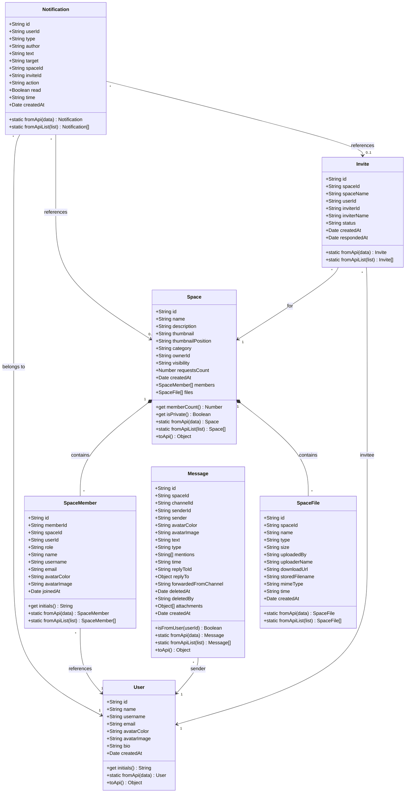
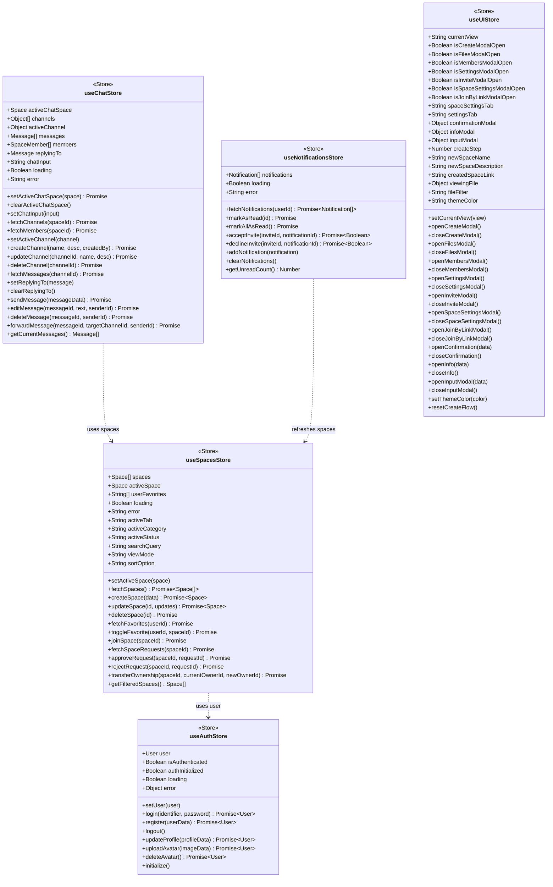
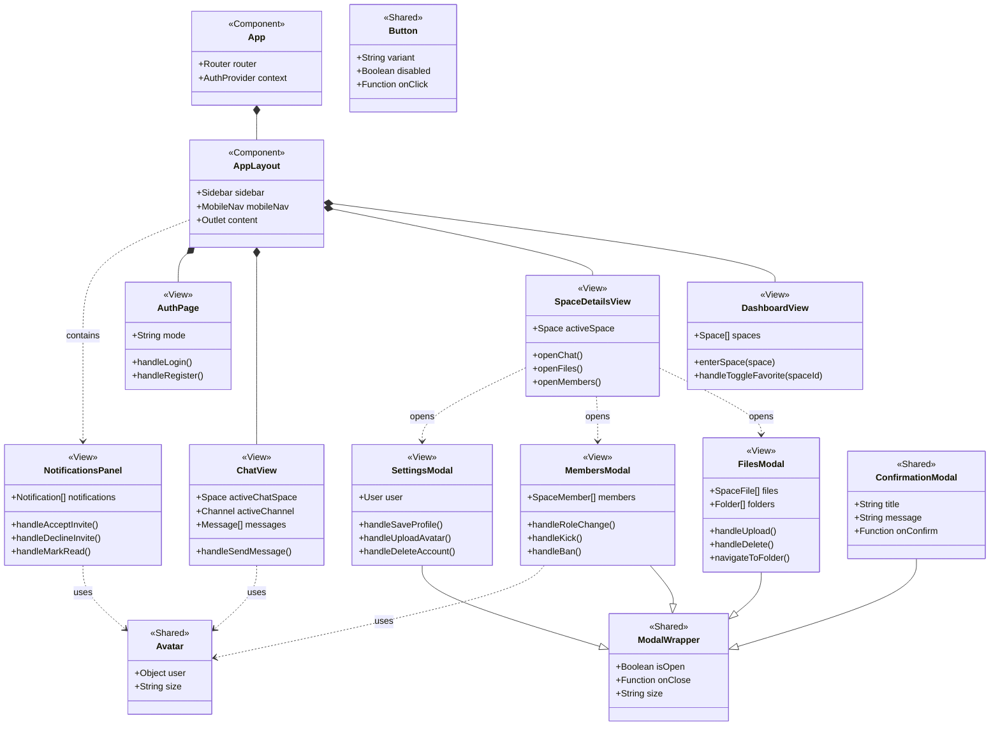
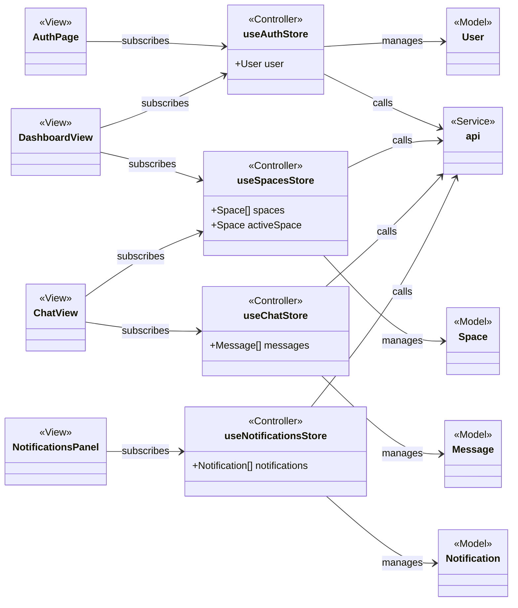
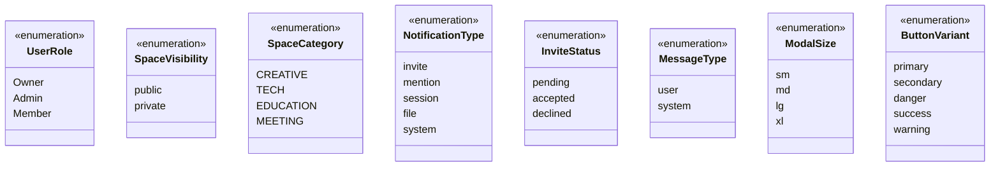

# Class Diagrams

## Complete System Class Diagram

---

## Controllers (Zustand Stores) Class Diagram

---

## API Service Class Diagram

```mermaid
classDiagram
    direction LR

    class api {
        <<Service>>
        +auth AuthAPI
        +users UsersAPI
        +spaces SpacesAPI
        +members MembersAPI
        +invites InvitesAPI
        +requests RequestsAPI
        +notifications NotificationsAPI
        +channels ChannelsAPI
        +messages MessagesAPI
        +folders FoldersAPI
        +files FilesAPI
        +get(endpoint) Promise
        +post(endpoint, body) Promise
        +put(endpoint, body) Promise
        +delete(endpoint, body) Promise
    }

    class AuthAPI {
        +register(data) Promise
        +login(data) Promise
    }

    class UsersAPI {
        +getAll() Promise
        +getById(id) Promise
        +update(id, data) Promise
        +delete(id) Promise
        +uploadAvatar(id, imageData) Promise
        +deleteAvatar(id) Promise
        +getSpaces(userId) Promise
        +getInvites(userId) Promise
        +getProfile(id, viewerId) Promise
        +updatePrivacy(id, data) Promise
        +getSharedSpaces(id, viewerId) Promise
        +search(query, viewerId) Promise
        +getFavorites(userId) Promise
        +addFavorite(userId, spaceId) Promise
        +removeFavorite(userId, spaceId) Promise
        +toggleFavorite(userId, spaceId) Promise
    }

    class SpacesAPI {
        +getAll(userId) Promise
        +search(query, userId) Promise
        +getById(id) Promise
        +create(data) Promise
        +update(id, data) Promise
        +delete(id) Promise
        +join(spaceId, userId) Promise
        +getRequests(spaceId) Promise
        +approveRequest(spaceId, requestId) Promise
        +rejectRequest(spaceId, requestId) Promise
        +transferOwnership(spaceId, currentOwnerId, newOwnerId) Promise
        +uploadThumbnail(spaceId, imageData) Promise
        +getBans(spaceId) Promise
        +unban(spaceId, banId) Promise
    }

    class MembersAPI {
        +getBySpace(spaceId) Promise
        +add(spaceId, data) Promise
        +updateRole(spaceId, memberId, role) Promise
        +remove(spaceId, memberId) Promise
        +ban(spaceId, memberId, bannedBy, reason) Promise
        +leave(spaceId, userId) Promise
        +invite(spaceId, data) Promise
        +inviteUser(spaceId, userId, inviterId) Promise
    }

    class InvitesAPI {
        +accept(inviteId) Promise
        +decline(inviteId) Promise
        +getBySpace(spaceId) Promise
        +getByCode(code) Promise
        +revoke(inviteId) Promise
    }

    class ChannelsAPI {
        +getBySpace(spaceId) Promise
        +create(spaceId, data) Promise
        +update(channelId, data) Promise
        +delete(channelId) Promise
    }

    class MessagesAPI {
        +getByChannel(channelId) Promise
        +send(channelId, data) Promise
        +update(id, text, senderId) Promise
        +delete(id, senderId) Promise
        +forward(messageId, targetChannelId, senderId, spaceId) Promise
    }

    class FilesAPI {
        +getBySpace(spaceId, folderId) Promise
        +upload(spaceId, file, uploadedBy, onProgress, folderId) Promise
        +rename(fileId, name, userId) Promise
        +delete(fileId, userId) Promise
        +move(fileIds, folderId, userId) Promise
        +copy(fileIds, folderId, userId) Promise
        +download(fileId) String
        +createLink(spaceId, name, url, uploadedBy, folderId) Promise
    }

    class FoldersAPI {
        +getBySpace(spaceId, parentId) Promise
        +getById(folderId) Promise
        +create(spaceId, data) Promise
        +update(folderId, name) Promise
        +delete(folderId) Promise
    }

    class NotificationsAPI {
        +getAll(userId) Promise
        +create(data) Promise
        +markRead(id) Promise
        +markAllRead() Promise
    }

    class RequestsAPI {
        +cancel(spaceId, requestId) Promise
        +getMy(userId) Promise
        +cancelMy(userId, requestId) Promise
    }

    api *-- AuthAPI
    api *-- UsersAPI
    api *-- SpacesAPI
    api *-- MembersAPI
    api *-- InvitesAPI
    api *-- ChannelsAPI
    api *-- MessagesAPI
    api *-- FilesAPI
    api *-- FoldersAPI
    api *-- NotificationsAPI
    api *-- RequestsAPI
```

---

## View Components Hierarchy

---

## Model-Store-View Relationships

---

## Enum Types

