# Data Flow Diagrams (DFD)

## DFD Notation

| Symbol  | Meaning                       |
| ------- | ----------------------------- |
| `[[ ]]` | External Entity (Source/Sink) |
| `( )`   | Process                       |
| `[( )]` | Data Store                    |
| `-->`   | Data Flow                     |

---

## Level 0: Context Diagram

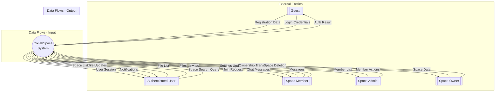

---

## Level 1: System Overview DFD

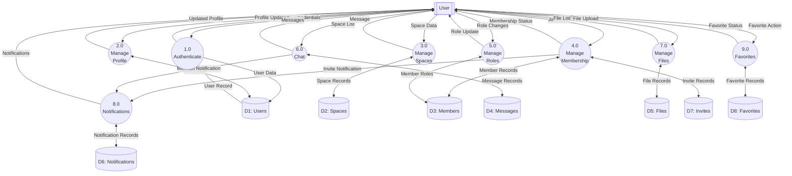

---

## Level 2: Process 1.0 - Authenticate

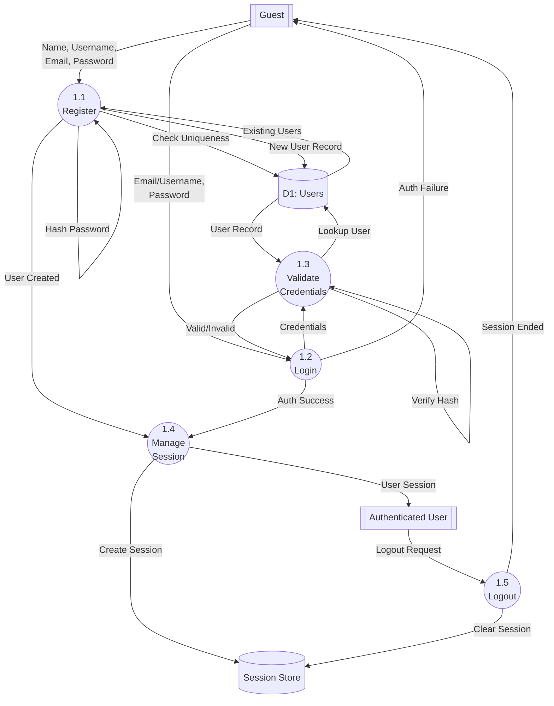

---

## Level 2: Process 2.0 - Manage Profile

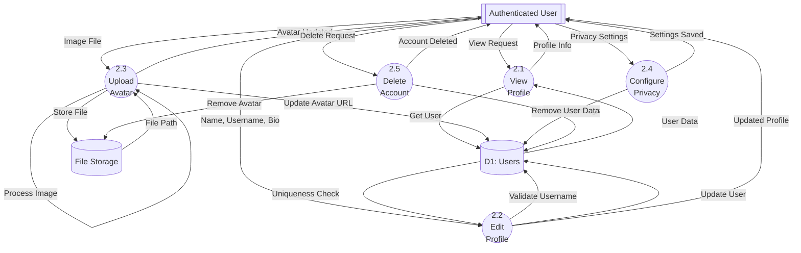

---

## Level 2: Process 3.0 - Manage Spaces

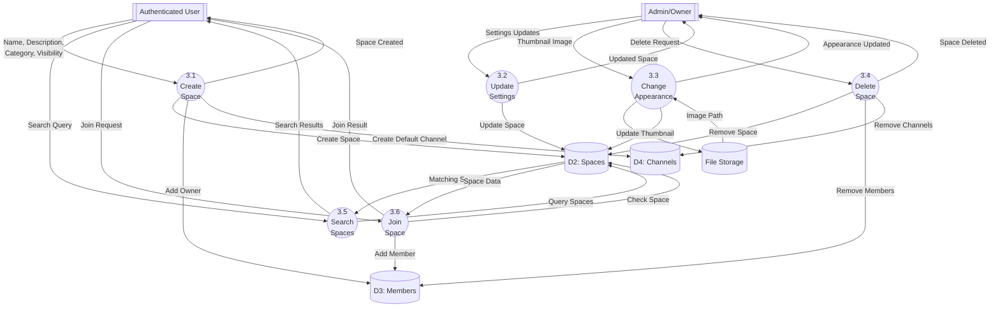

---

## Level 2: Process 4.0 - Manage Membership

```mermaid
flowchart TB
    %% External Entities
    User[[User]]
    Admin[[Admin/Owner]]

    %% Processes
    P4_1((4.1\nInvite\nUser))
    P4_2((4.2\nGenerate\nInvite Link))
    P4_3((4.3\nJoin via\nLink))
    P4_4((4.4\nRequest\nto Join))
    P4_5((4.5\nApprove/Reject\nRequest))
    P4_6((4.6\nRemove\nMember))
    P4_7((4.7\nBan\nMember))
    P4_8((4.8\nLeave\nSpace))

    %% Data Stores
    D3[(D3: Members)]
    D6[(D6: Notifications)]
    D7[(D7: Invites)]
    D_Requests[(Join Requests)]
    D_Bans[(Space Bans)]

    %% Invite User
    Admin -->|User ID, Space ID| P4_1
    P4_1 -->|Create Invite| D7
    P4_1 -->|Create Notification| D6
    P4_1 -->|Invite Sent| Admin

    %% Generate Link
    Admin -->|Space ID| P4_2
    P4_2 -->|Create Link Code| D7
    P4_2 -->|Invite Link| Admin

    %% Join via Link
    User -->|Invite Code| P4_3
    P4_3 -->|Validate Code| D7
    D7 -->|Invite Data| P4_3
    P4_3 -->|Add Member| D3
    P4_3 -->|Joined| User

    %% Request to Join
    User -->|Space ID| P4_4
    P4_4 -->|Create Request| D_Requests
    P4_4 -->|Notify Admins| D6
    P4_4 -->|Request Sent| User

    %% Approve/Reject
    Admin -->|Request ID, Action| P4_5
    P4_5 -->|Update Request| D_Requests
    P4_5 -->|Add Member if Approved| D3
    P4_5 -->|Notify User| D6
    P4_5 -->|Action Complete| Admin

    %% Remove Member
    Admin -->|Member ID| P4_6
    P4_6 -->|Remove Member| D3
    P4_6 -->|Member Removed| Admin

    %% Ban Member
    Admin -->|Member ID, Reason| P4_7
    P4_7 -->|Remove Member| D3
    P4_7 -->|Create Ban Record| D_Bans
    P4_7 -->|Member Banned| Admin

    %% Leave Space
    User -->|Space ID| P4_8
    P4_8 -->|Remove Self| D3
    P4_8 -->|Left Space| User
```

---

## Level 2: Process 5.0 - Manage Roles

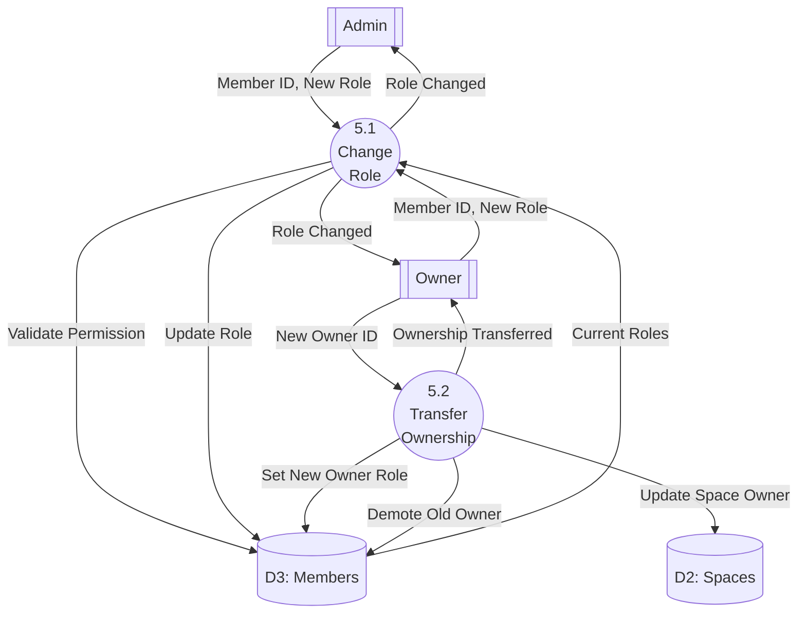

---

## Level 2: Process 6.0 - Chat

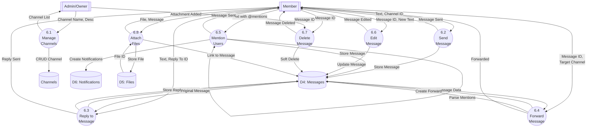

---

## Level 2: Process 7.0 - Manage Files

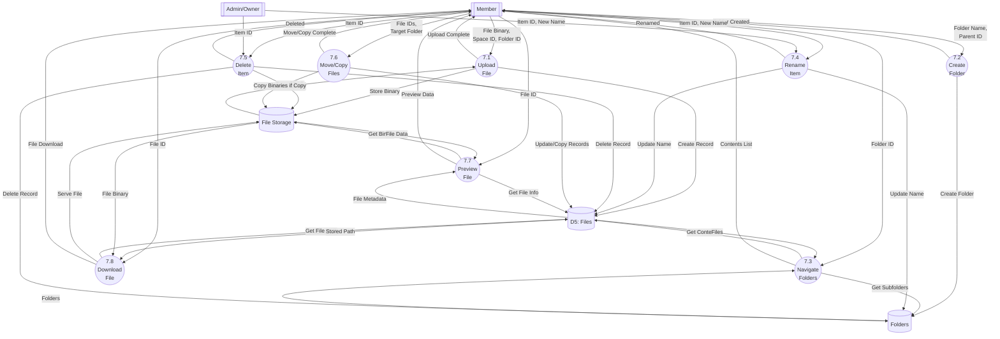

---

## Level 2: Process 8.0 - Notifications

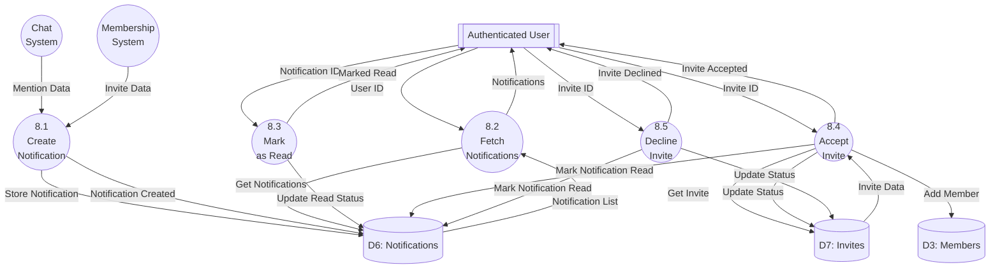

---

## Level 2: Process 9.0 - Favorites

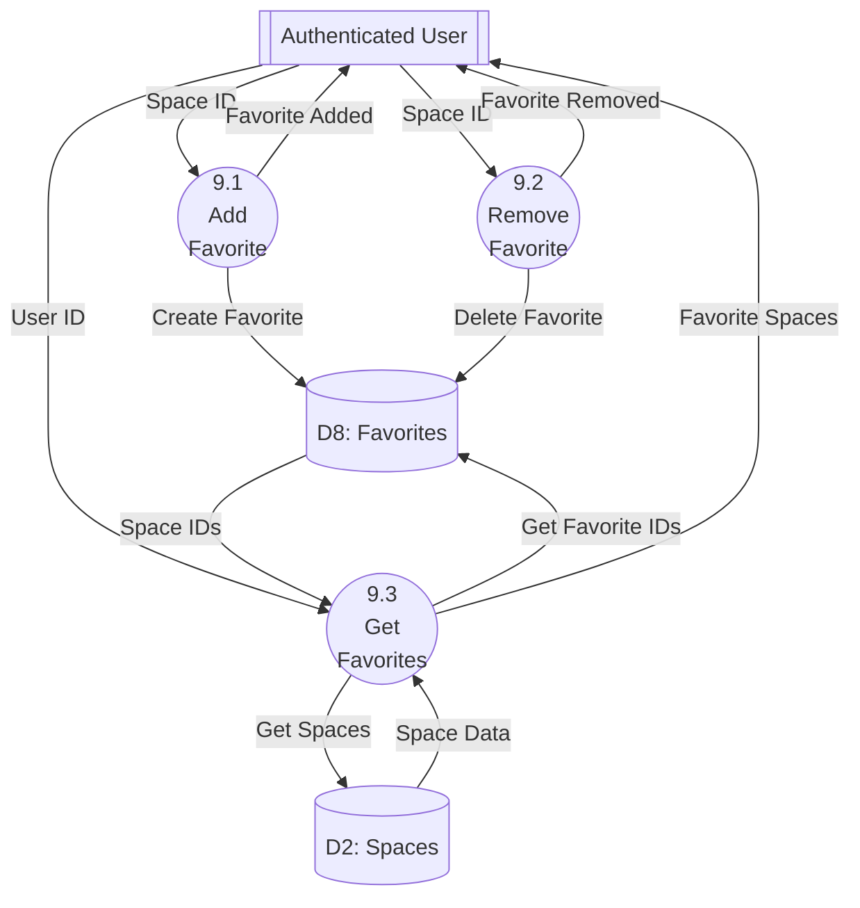

---

## Data Store Dictionary

| Store ID | Name          | Description                  | Key Fields                                                  |
| -------- | ------------- | ---------------------------- | ----------------------------------------------------------- |
| D1       | Users         | User account information     | id, name, username, email, password_hash, avatar            |
| D2       | Spaces        | Collaborative workspace data | id, name, description, owner_id, visibility                 |
| D3       | Members       | Space membership records     | id, space_id, user_id, role, joined_at                      |
| D4       | Messages      | Chat messages                | id, channel_id, sender_id, text, mentions, reply_to_id      |
| D5       | Files         | File metadata                | id, space_id, folder_id, name, stored_filename, uploaded_by |
| D6       | Notifications | User notifications           | id, user_id, type, text, read, space_id                     |
| D7       | Invites       | Space invitations            | id, space_id, user_id, inviter_id, status, code             |
| D8       | Favorites     | User favorite spaces         | id, user_id, space_id                                       |

---

## Data Flow Summary

| Process               | Input Data       | Output Data       | Data Stores Accessed           |
| --------------------- | ---------------- | ----------------- | ------------------------------ |
| 1.0 Authenticate      | Credentials      | Session           | D1: Users                      |
| 2.0 Manage Profile    | Profile Data     | Updated Profile   | D1: Users                      |
| 3.0 Manage Spaces     | Space Data       | Space List        | D2: Spaces, D3: Members        |
| 4.0 Manage Membership | Invite/Join Data | Membership Status | D3: Members, D7: Invites       |
| 5.0 Manage Roles      | Role Changes     | Updated Roles     | D2: Spaces, D3: Members        |
| 6.0 Chat              | Messages         | Message List      | D4: Messages                   |
| 7.0 Manage Files      | Files            | File List         | D5: Files                      |
| 8.0 Notifications     | Actions          | Notifications     | D6: Notifications, D7: Invites |
| 9.0 Favorites         | Favorite Actions | Favorite List     | D8: Favorites, D2: Spaces      |

---

## Physical Data Flow Diagram

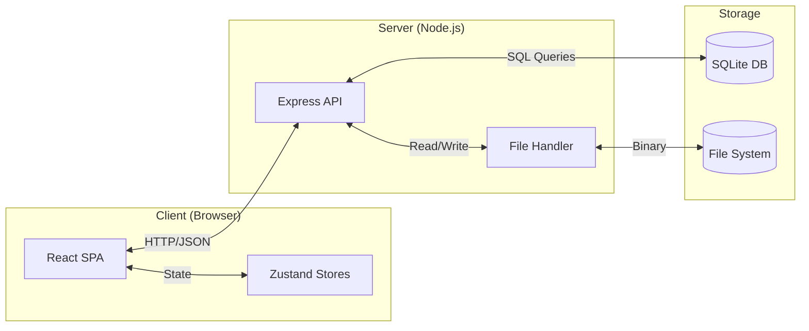
