# Sequence Diagrams

## UC-01: Authenticate

### UC-01.1: Register Account

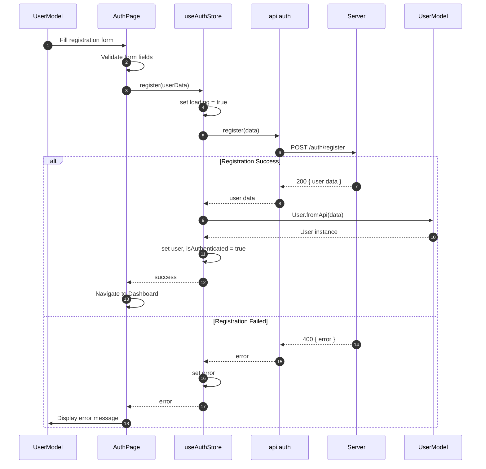
```mermaid
sequenceDiagram
    autonumber
    actor User
    participant AuthPage
    participant useAuthStore
    participant api.auth
    participant Server
    participant User as UserModel

    User->>AuthPage: Fill registration form
    AuthPage->>AuthPage: Validate form fields
    AuthPage->>useAuthStore: register(userData)
    useAuthStore->>useAuthStore: set loading = true
    useAuthStore->>api.auth: register(data)
    api.auth->>Server: POST /auth/register

    alt Registration Success
        Server-->>api.auth: 200 { user data }
        api.auth-->>useAuthStore: user data
        useAuthStore->>UserModel: User.fromApi(data)
        UserModel-->>useAuthStore: User instance
        useAuthStore->>useAuthStore: set user, isAuthenticated = true
        useAuthStore-->>AuthPage: success
        AuthPage->>AuthPage: Navigate to Dashboard
    else Registration Failed
        Server-->>api.auth: 400 { error }
        api.auth-->>useAuthStore: error
        useAuthStore->>useAuthStore: set error
        useAuthStore-->>AuthPage: error
        AuthPage->>User: Display error message
    end
```

### UC-01.2: Login

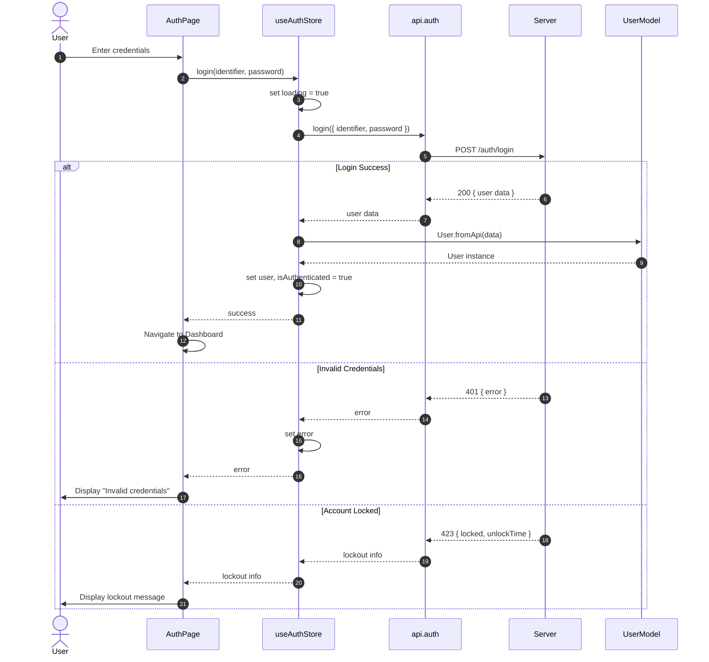
```mermaid
sequenceDiagram
    autonumber
    actor User
    participant AuthPage
    participant useAuthStore
    participant api.auth
    participant Server
    participant UserModel

    User->>AuthPage: Enter credentials
    AuthPage->>useAuthStore: login(identifier, password)
    useAuthStore->>useAuthStore: set loading = true
    useAuthStore->>api.auth: login({ identifier, password })
    api.auth->>Server: POST /auth/login

    alt Login Success
        Server-->>api.auth: 200 { user data }
        api.auth-->>useAuthStore: user data
        useAuthStore->>UserModel: User.fromApi(data)
        UserModel-->>useAuthStore: User instance
        useAuthStore->>useAuthStore: set user, isAuthenticated = true
        useAuthStore-->>AuthPage: success
        AuthPage->>AuthPage: Navigate to Dashboard
    else Invalid Credentials
        Server-->>api.auth: 401 { error }
        api.auth-->>useAuthStore: error
        useAuthStore->>useAuthStore: set error
        useAuthStore-->>AuthPage: error
        AuthPage->>User: Display "Invalid credentials"
    else Account Locked
        Server-->>api.auth: 423 { locked, unlockTime }
        api.auth-->>useAuthStore: lockout info
        useAuthStore-->>AuthPage: lockout info
        AuthPage->>User: Display lockout message
    end
```

### UC-01.3: Logout

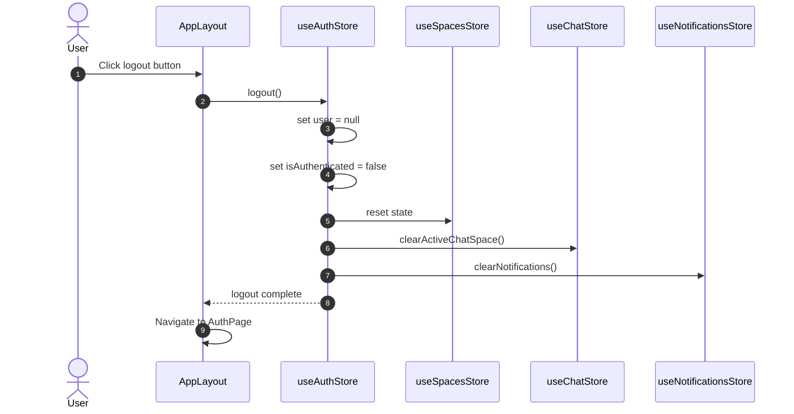
```mermaid
sequenceDiagram
    autonumber
    actor User
    participant AppLayout
    participant useAuthStore
    participant useSpacesStore
    participant useChatStore
    participant useNotificationsStore

    User->>AppLayout: Click logout button
    AppLayout->>useAuthStore: logout()
    useAuthStore->>useAuthStore: set user = null
    useAuthStore->>useAuthStore: set isAuthenticated = false
    useAuthStore->>useSpacesStore: reset state
    useAuthStore->>useChatStore: clearActiveChatSpace()
    useAuthStore->>useNotificationsStore: clearNotifications()
    useAuthStore-->>AppLayout: logout complete
    AppLayout->>AppLayout: Navigate to AuthPage
```

---

## UC-02: Manage Profile

### UC-02.1: View Profile

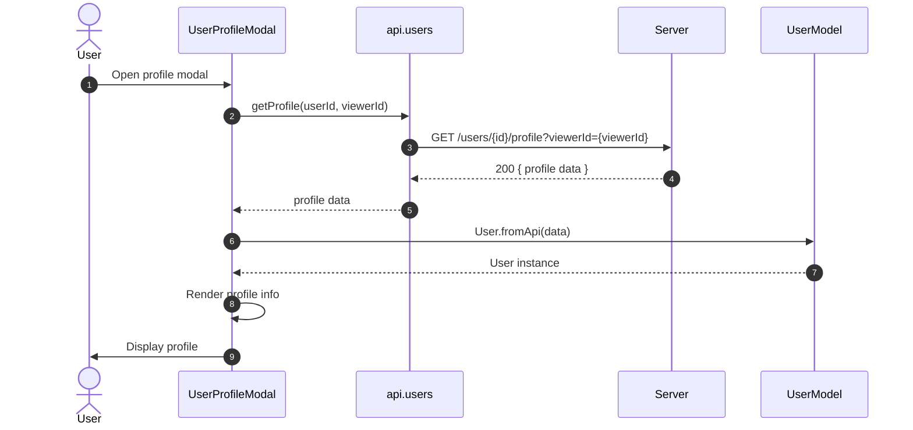
```mermaid
sequenceDiagram
    autonumber
    actor User
    participant UserProfileModal
    participant api.users
    participant Server
    participant UserModel

    User->>UserProfileModal: Open profile modal
    UserProfileModal->>api.users: getProfile(userId, viewerId)
    api.users->>Server: GET /users/{id}/profile?viewerId={viewerId}
    Server-->>api.users: 200 { profile data }
    api.users-->>UserProfileModal: profile data
    UserProfileModal->>UserModel: User.fromApi(data)
    UserModel-->>UserProfileModal: User instance
    UserProfileModal->>UserProfileModal: Render profile info
    UserProfileModal->>User: Display profile
```

### UC-02.2: Edit Profile

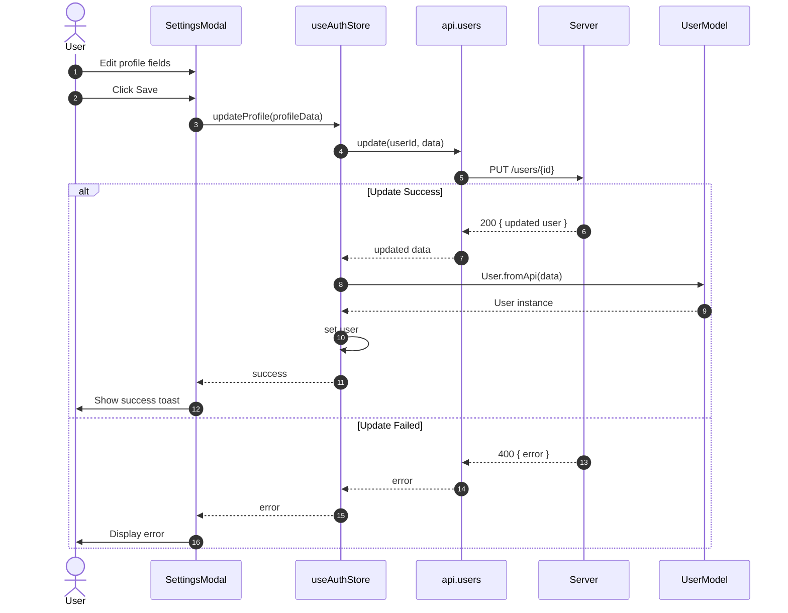
```mermaid
sequenceDiagram
    autonumber
    actor User
    participant SettingsModal
    participant useAuthStore
    participant api.users
    participant Server
    participant UserModel

    User->>SettingsModal: Edit profile fields
    User->>SettingsModal: Click Save
    SettingsModal->>useAuthStore: updateProfile(profileData)
    useAuthStore->>api.users: update(userId, data)
    api.users->>Server: PUT /users/{id}

    alt Update Success
        Server-->>api.users: 200 { updated user }
        api.users-->>useAuthStore: updated data
        useAuthStore->>UserModel: User.fromApi(data)
        UserModel-->>useAuthStore: User instance
        useAuthStore->>useAuthStore: set user
        useAuthStore-->>SettingsModal: success
        SettingsModal->>User: Show success toast
    else Update Failed
        Server-->>api.users: 400 { error }
        api.users-->>useAuthStore: error
        useAuthStore-->>SettingsModal: error
        SettingsModal->>User: Display error
    end
```

### UC-02.3: Upload Avatar

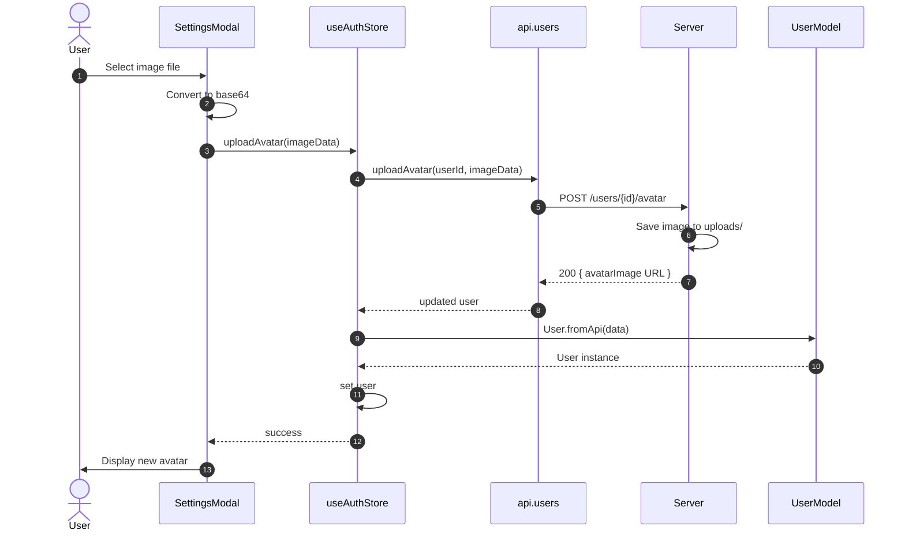
```mermaid
sequenceDiagram
    autonumber
    actor User
    participant SettingsModal
    participant useAuthStore
    participant api.users
    participant Server
    participant UserModel

    User->>SettingsModal: Select image file
    SettingsModal->>SettingsModal: Convert to base64
    SettingsModal->>useAuthStore: uploadAvatar(imageData)
    useAuthStore->>api.users: uploadAvatar(userId, imageData)
    api.users->>Server: POST /users/{id}/avatar
    Server->>Server: Save image to uploads/
    Server-->>api.users: 200 { avatarImage URL }
    api.users-->>useAuthStore: updated user
    useAuthStore->>UserModel: User.fromApi(data)
    UserModel-->>useAuthStore: User instance
    useAuthStore->>useAuthStore: set user
    useAuthStore-->>SettingsModal: success
    SettingsModal->>User: Display new avatar
```

### UC-02.4: Delete Account

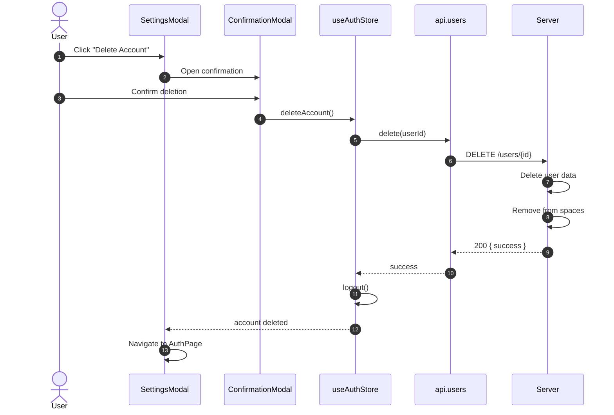
```mermaid
sequenceDiagram
    autonumber
    actor User
    participant SettingsModal
    participant ConfirmationModal
    participant useAuthStore
    participant api.users
    participant Server

    User->>SettingsModal: Click "Delete Account"
    SettingsModal->>ConfirmationModal: Open confirmation
    User->>ConfirmationModal: Confirm deletion
    ConfirmationModal->>useAuthStore: deleteAccount()
    useAuthStore->>api.users: delete(userId)
    api.users->>Server: DELETE /users/{id}
    Server->>Server: Delete user data
    Server->>Server: Remove from spaces
    Server-->>api.users: 200 { success }
    api.users-->>useAuthStore: success
    useAuthStore->>useAuthStore: logout()
    useAuthStore-->>SettingsModal: account deleted
    SettingsModal->>SettingsModal: Navigate to AuthPage
```

---

## UC-03: Manage Space Lifecycle

### UC-03.1: Create Space

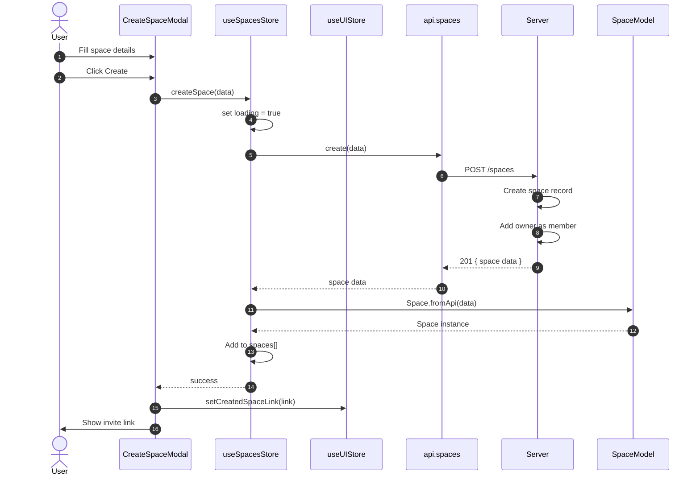
```mermaid
sequenceDiagram
    autonumber
    actor User
    participant CreateSpaceModal
    participant useSpacesStore
    participant useUIStore
    participant api.spaces
    participant Server
    participant SpaceModel

    User->>CreateSpaceModal: Fill space details
    User->>CreateSpaceModal: Click Create
    CreateSpaceModal->>useSpacesStore: createSpace(data)
    useSpacesStore->>useSpacesStore: set loading = true
    useSpacesStore->>api.spaces: create(data)
    api.spaces->>Server: POST /spaces
    Server->>Server: Create space record
    Server->>Server: Add owner as member
    Server-->>api.spaces: 201 { space data }
    api.spaces-->>useSpacesStore: space data
    useSpacesStore->>SpaceModel: Space.fromApi(data)
    SpaceModel-->>useSpacesStore: Space instance
    useSpacesStore->>useSpacesStore: Add to spaces[]
    useSpacesStore-->>CreateSpaceModal: success
    CreateSpaceModal->>useUIStore: setCreatedSpaceLink(link)
    CreateSpaceModal->>User: Show invite link
```

### UC-03.2: Edit Space

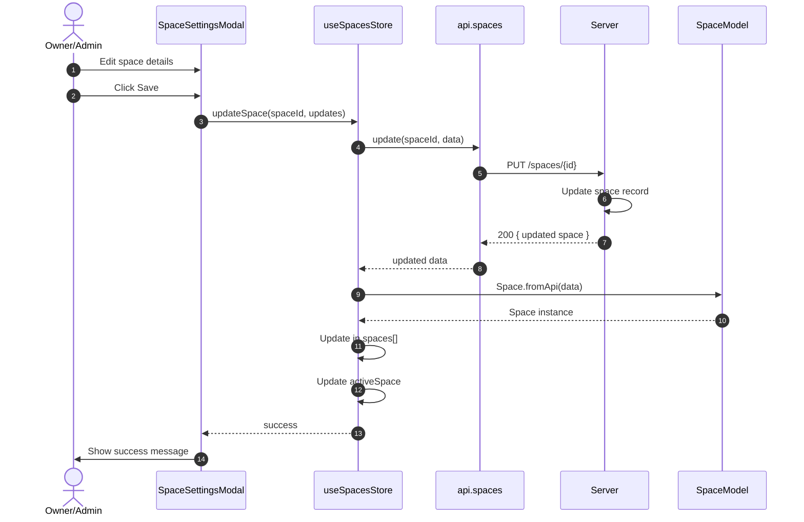
```mermaid
sequenceDiagram
    autonumber
    actor Owner/Admin
    participant SpaceSettingsModal
    participant useSpacesStore
    participant api.spaces
    participant Server
    participant SpaceModel

    Owner/Admin->>SpaceSettingsModal: Edit space details
    Owner/Admin->>SpaceSettingsModal: Click Save
    SpaceSettingsModal->>useSpacesStore: updateSpace(spaceId, updates)
    useSpacesStore->>api.spaces: update(spaceId, data)
    api.spaces->>Server: PUT /spaces/{id}
    Server->>Server: Update space record
    Server-->>api.spaces: 200 { updated space }
    api.spaces-->>useSpacesStore: updated data
    useSpacesStore->>SpaceModel: Space.fromApi(data)
    SpaceModel-->>useSpacesStore: Space instance
    useSpacesStore->>useSpacesStore: Update in spaces[]
    useSpacesStore->>useSpacesStore: Update activeSpace
    useSpacesStore-->>SpaceSettingsModal: success
    SpaceSettingsModal->>Owner/Admin: Show success message
```

### UC-03.3: Delete Space

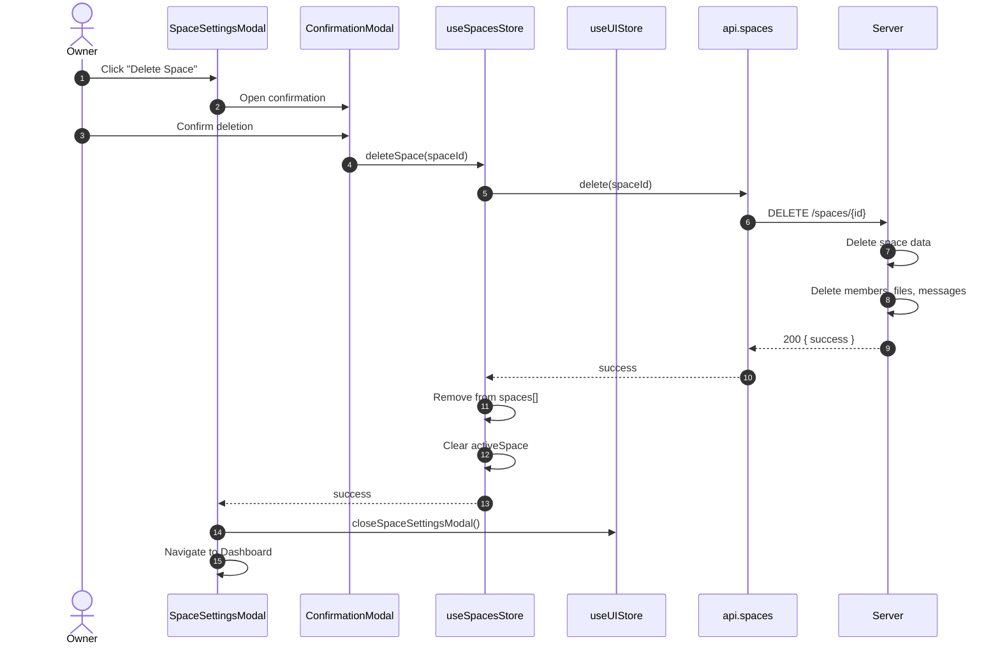
```mermaid
sequenceDiagram
    autonumber
    actor Owner
    participant SpaceSettingsModal
    participant ConfirmationModal
    participant useSpacesStore
    participant useUIStore
    participant api.spaces
    participant Server

    Owner->>SpaceSettingsModal: Click "Delete Space"
    SpaceSettingsModal->>ConfirmationModal: Open confirmation
    Owner->>ConfirmationModal: Confirm deletion
    ConfirmationModal->>useSpacesStore: deleteSpace(spaceId)
    useSpacesStore->>api.spaces: delete(spaceId)
    api.spaces->>Server: DELETE /spaces/{id}
    Server->>Server: Delete space data
    Server->>Server: Delete members, files, messages
    Server-->>api.spaces: 200 { success }
    api.spaces-->>useSpacesStore: success
    useSpacesStore->>useSpacesStore: Remove from spaces[]
    useSpacesStore->>useSpacesStore: Clear activeSpace
    useSpacesStore-->>SpaceSettingsModal: success
    SpaceSettingsModal->>useUIStore: closeSpaceSettingsModal()
    SpaceSettingsModal->>SpaceSettingsModal: Navigate to Dashboard
```

### UC-03.4: Search Public Spaces

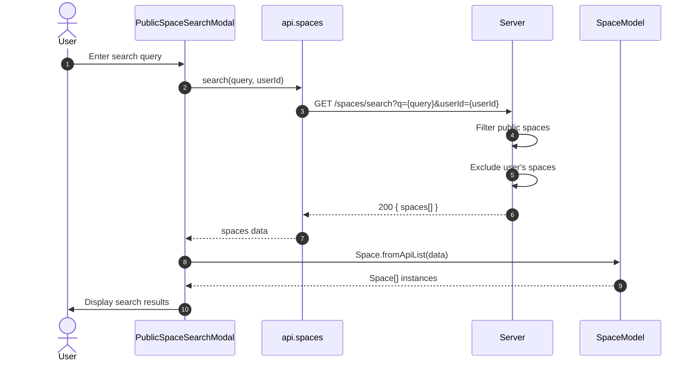
```mermaid
sequenceDiagram
    autonumber
    actor User
    participant PublicSpaceSearchModal
    participant api.spaces
    participant Server
    participant SpaceModel

    User->>PublicSpaceSearchModal: Enter search query
    PublicSpaceSearchModal->>api.spaces: search(query, userId)
    api.spaces->>Server: GET /spaces/search?q={query}&userId={userId}
    Server->>Server: Filter public spaces
    Server->>Server: Exclude user's spaces
    Server-->>api.spaces: 200 { spaces[] }
    api.spaces-->>PublicSpaceSearchModal: spaces data
    PublicSpaceSearchModal->>SpaceModel: Space.fromApiList(data)
    SpaceModel-->>PublicSpaceSearchModal: Space[] instances
    PublicSpaceSearchModal->>User: Display search results
```

### UC-03.5: Join Public Space

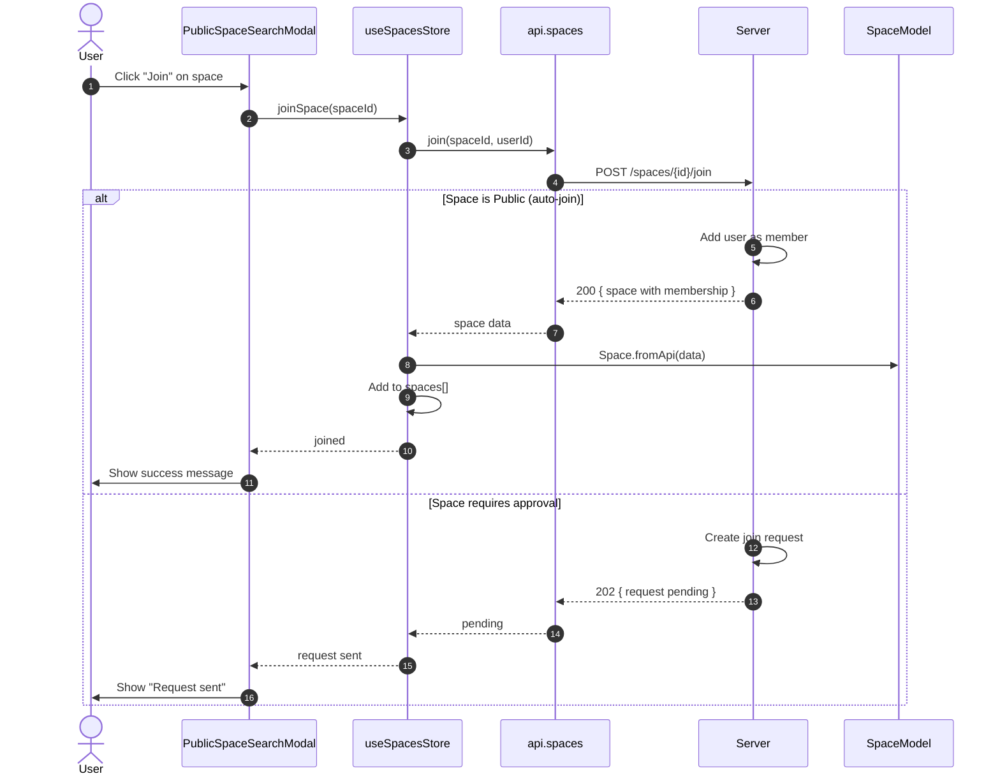
```mermaid
sequenceDiagram
    autonumber
    actor User
    participant PublicSpaceSearchModal
    participant useSpacesStore
    participant api.spaces
    participant Server
    participant SpaceModel

    User->>PublicSpaceSearchModal: Click "Join" on space
    PublicSpaceSearchModal->>useSpacesStore: joinSpace(spaceId)
    useSpacesStore->>api.spaces: join(spaceId, userId)
    api.spaces->>Server: POST /spaces/{id}/join

    alt Space is Public (auto-join)
        Server->>Server: Add user as member
        Server-->>api.spaces: 200 { space with membership }
        api.spaces-->>useSpacesStore: space data
        useSpacesStore->>SpaceModel: Space.fromApi(data)
        useSpacesStore->>useSpacesStore: Add to spaces[]
        useSpacesStore-->>PublicSpaceSearchModal: joined
        PublicSpaceSearchModal->>User: Show success message
    else Space requires approval
        Server->>Server: Create join request
        Server-->>api.spaces: 202 { request pending }
        api.spaces-->>useSpacesStore: pending
        useSpacesStore-->>PublicSpaceSearchModal: request sent
        PublicSpaceSearchModal->>User: Show "Request sent"
    end
```

### UC-03.6: Join by Invite Link

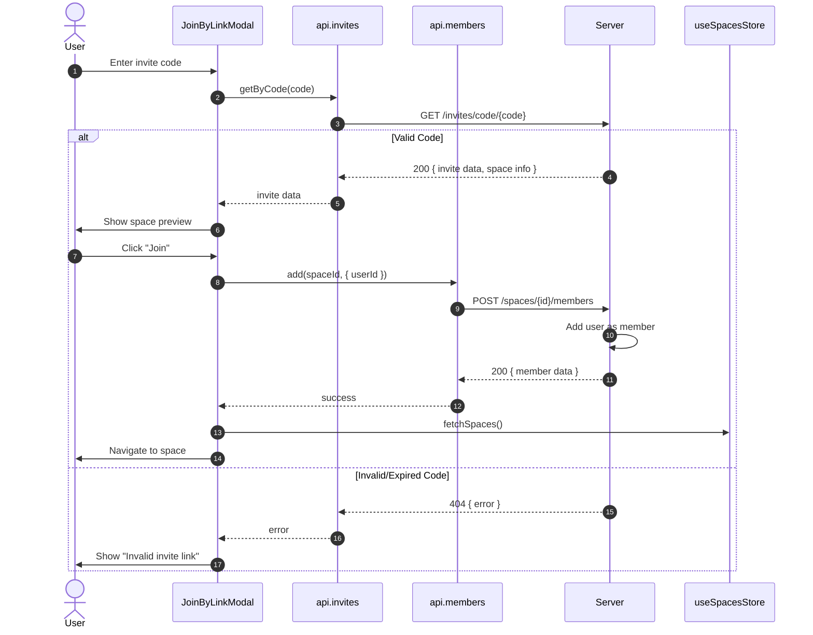
```mermaid
sequenceDiagram
    autonumber
    actor User
    participant JoinByLinkModal
    participant api.invites
    participant api.members
    participant Server
    participant useSpacesStore

    User->>JoinByLinkModal: Enter invite code
    JoinByLinkModal->>api.invites: getByCode(code)
    api.invites->>Server: GET /invites/code/{code}

    alt Valid Code
        Server-->>api.invites: 200 { invite data, space info }
        api.invites-->>JoinByLinkModal: invite data
        JoinByLinkModal->>User: Show space preview
        User->>JoinByLinkModal: Click "Join"
        JoinByLinkModal->>api.members: add(spaceId, { userId })
        api.members->>Server: POST /spaces/{id}/members
        Server->>Server: Add user as member
        Server-->>api.members: 200 { member data }
        api.members-->>JoinByLinkModal: success
        JoinByLinkModal->>useSpacesStore: fetchSpaces()
        JoinByLinkModal->>User: Navigate to space
    else Invalid/Expired Code
        Server-->>api.invites: 404 { error }
        api.invites-->>JoinByLinkModal: error
        JoinByLinkModal->>User: Show "Invalid invite link"
    end
```

---

## UC-04: Manage Membership

### UC-04.1: View Members

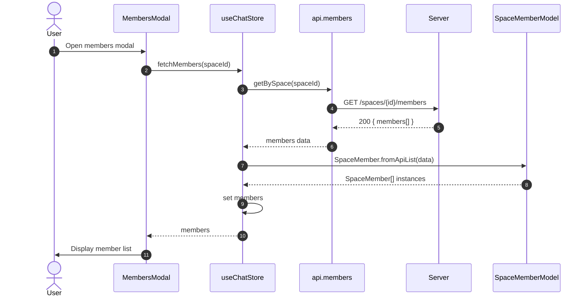
```mermaid
sequenceDiagram
    autonumber
    actor User
    participant MembersModal
    participant useChatStore
    participant api.members
    participant Server
    participant SpaceMemberModel

    User->>MembersModal: Open members modal
    MembersModal->>useChatStore: fetchMembers(spaceId)
    useChatStore->>api.members: getBySpace(spaceId)
    api.members->>Server: GET /spaces/{id}/members
    Server-->>api.members: 200 { members[] }
    api.members-->>useChatStore: members data
    useChatStore->>SpaceMemberModel: SpaceMember.fromApiList(data)
    SpaceMemberModel-->>useChatStore: SpaceMember[] instances
    useChatStore->>useChatStore: set members
    useChatStore-->>MembersModal: members
    MembersModal->>User: Display member list
```

### UC-04.2: Invite User

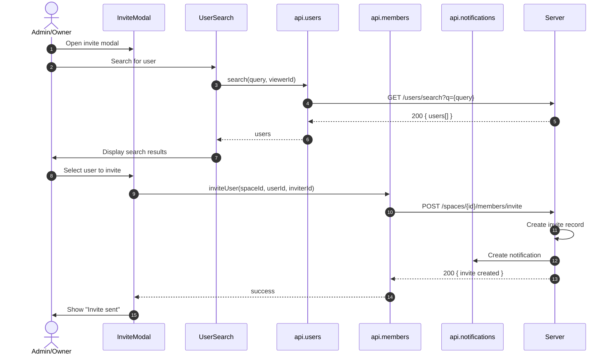
```mermaid
sequenceDiagram
    autonumber
    actor Admin/Owner
    participant InviteModal
    participant UserSearch
    participant api.users
    participant api.members
    participant api.notifications
    participant Server

    Admin/Owner->>InviteModal: Open invite modal
    Admin/Owner->>UserSearch: Search for user
    UserSearch->>api.users: search(query, viewerId)
    api.users->>Server: GET /users/search?q={query}
    Server-->>api.users: 200 { users[] }
    api.users-->>UserSearch: users
    UserSearch->>Admin/Owner: Display search results

    Admin/Owner->>InviteModal: Select user to invite
    InviteModal->>api.members: inviteUser(spaceId, userId, inviterId)
    api.members->>Server: POST /spaces/{id}/members/invite
    Server->>Server: Create invite record
    Server->>api.notifications: Create notification
    Server-->>api.members: 200 { invite created }
    api.members-->>InviteModal: success
    InviteModal->>Admin/Owner: Show "Invite sent"
```

### UC-04.3: Remove Member (Kick)

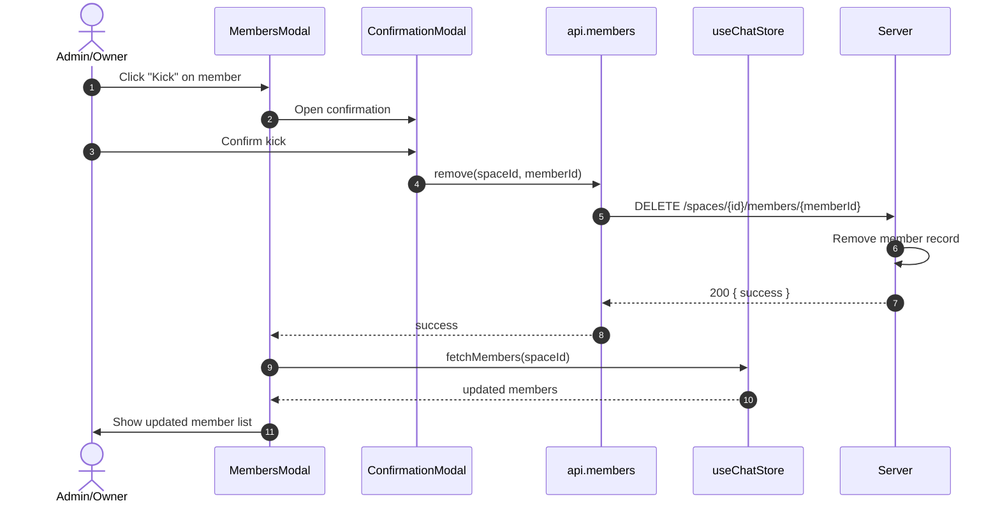
```mermaid
sequenceDiagram
    autonumber
    actor Admin/Owner
    participant MembersModal
    participant ConfirmationModal
    participant api.members
    participant useChatStore
    participant Server

    Admin/Owner->>MembersModal: Click "Kick" on member
    MembersModal->>ConfirmationModal: Open confirmation
    Admin/Owner->>ConfirmationModal: Confirm kick
    ConfirmationModal->>api.members: remove(spaceId, memberId)
    api.members->>Server: DELETE /spaces/{id}/members/{memberId}
    Server->>Server: Remove member record
    Server-->>api.members: 200 { success }
    api.members-->>MembersModal: success
    MembersModal->>useChatStore: fetchMembers(spaceId)
    useChatStore-->>MembersModal: updated members
    MembersModal->>Admin/Owner: Show updated member list
```

### UC-04.4: Ban Member

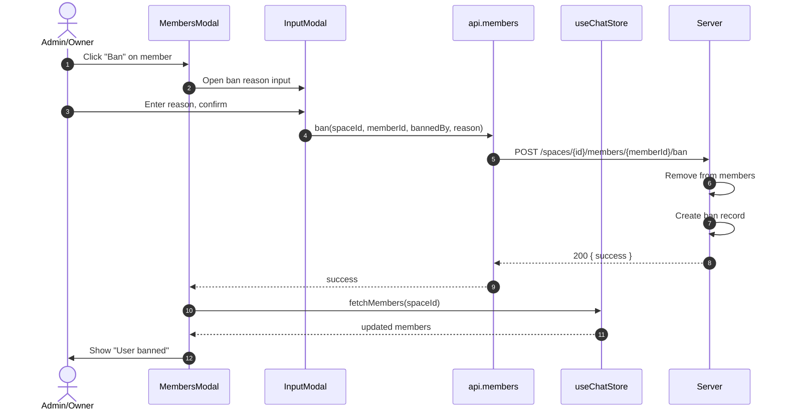
```mermaid
sequenceDiagram
    autonumber
    actor Admin/Owner
    participant MembersModal
    participant InputModal
    participant api.members
    participant useChatStore
    participant Server

    Admin/Owner->>MembersModal: Click "Ban" on member
    MembersModal->>InputModal: Open ban reason input
    Admin/Owner->>InputModal: Enter reason, confirm
    InputModal->>api.members: ban(spaceId, memberId, bannedBy, reason)
    api.members->>Server: POST /spaces/{id}/members/{memberId}/ban
    Server->>Server: Remove from members
    Server->>Server: Create ban record
    Server-->>api.members: 200 { success }
    api.members-->>MembersModal: success
    MembersModal->>useChatStore: fetchMembers(spaceId)
    useChatStore-->>MembersModal: updated members
    MembersModal->>Admin/Owner: Show "User banned"
```

### UC-04.5: Leave Space

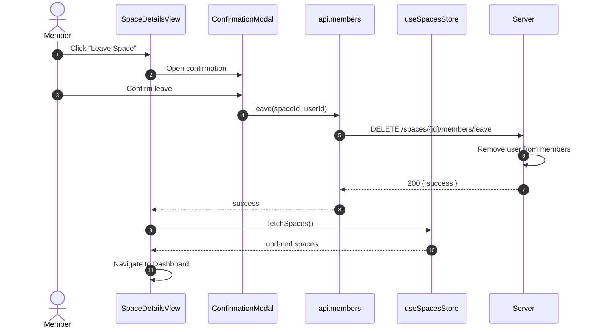
```mermaid
sequenceDiagram
    autonumber
    actor Member
    participant SpaceDetailsView
    participant ConfirmationModal
    participant api.members
    participant useSpacesStore
    participant Server

    Member->>SpaceDetailsView: Click "Leave Space"
    SpaceDetailsView->>ConfirmationModal: Open confirmation
    Member->>ConfirmationModal: Confirm leave
    ConfirmationModal->>api.members: leave(spaceId, userId)
    api.members->>Server: DELETE /spaces/{id}/members/leave
    Server->>Server: Remove user from members
    Server-->>api.members: 200 { success }
    api.members-->>SpaceDetailsView: success
    SpaceDetailsView->>useSpacesStore: fetchSpaces()
    useSpacesStore-->>SpaceDetailsView: updated spaces
    SpaceDetailsView->>SpaceDetailsView: Navigate to Dashboard
```

---

## UC-05: Manage Roles & Ownership

### UC-05.1: Change Member Role

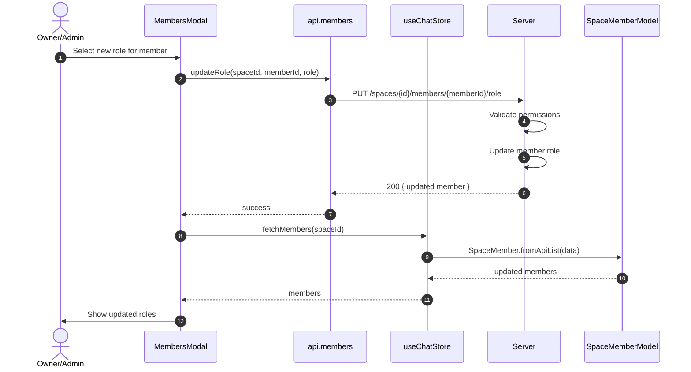
```mermaid
sequenceDiagram
    autonumber
    actor Owner/Admin
    participant MembersModal
    participant api.members
    participant useChatStore
    participant Server
    participant SpaceMemberModel

    Owner/Admin->>MembersModal: Select new role for member
    MembersModal->>api.members: updateRole(spaceId, memberId, role)
    api.members->>Server: PUT /spaces/{id}/members/{memberId}/role
    Server->>Server: Validate permissions
    Server->>Server: Update member role
    Server-->>api.members: 200 { updated member }
    api.members-->>MembersModal: success
    MembersModal->>useChatStore: fetchMembers(spaceId)
    useChatStore->>SpaceMemberModel: SpaceMember.fromApiList(data)
    SpaceMemberModel-->>useChatStore: updated members
    useChatStore-->>MembersModal: members
    MembersModal->>Owner/Admin: Show updated roles
```

### UC-05.2: Transfer Ownership

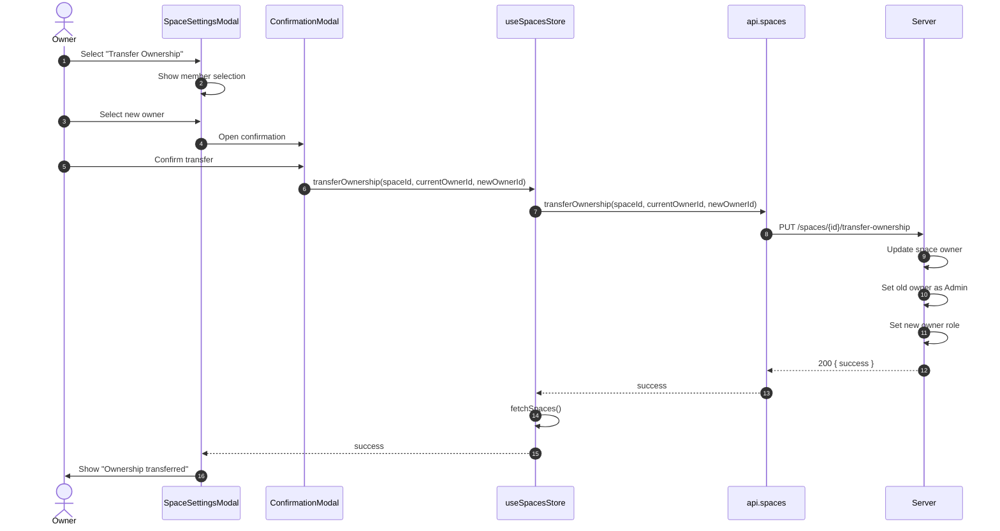
```mermaid
sequenceDiagram
    autonumber
    actor Owner
    participant SpaceSettingsModal
    participant ConfirmationModal
    participant useSpacesStore
    participant api.spaces
    participant Server

    Owner->>SpaceSettingsModal: Select "Transfer Ownership"
    SpaceSettingsModal->>SpaceSettingsModal: Show member selection
    Owner->>SpaceSettingsModal: Select new owner
    SpaceSettingsModal->>ConfirmationModal: Open confirmation
    Owner->>ConfirmationModal: Confirm transfer
    ConfirmationModal->>useSpacesStore: transferOwnership(spaceId, currentOwnerId, newOwnerId)
    useSpacesStore->>api.spaces: transferOwnership(spaceId, currentOwnerId, newOwnerId)
    api.spaces->>Server: PUT /spaces/{id}/transfer-ownership
    Server->>Server: Update space owner
    Server->>Server: Set old owner as Admin
    Server->>Server: Set new owner role
    Server-->>api.spaces: 200 { success }
    api.spaces-->>useSpacesStore: success
    useSpacesStore->>useSpacesStore: fetchSpaces()
    useSpacesStore-->>SpaceSettingsModal: success
    SpaceSettingsModal->>Owner: Show "Ownership transferred"
```

### UC-05.3: Approve Join Request

```mermaid
sequenceDiagram
    autonumber
    actor Owner/Admin
    participant SpaceSettingsModal
    participant useSpacesStore
    participant api.spaces
    participant Server

    Owner/Admin->>SpaceSettingsModal: View join requests
    SpaceSettingsModal->>useSpacesStore: fetchSpaceRequests(spaceId)
    useSpacesStore->>api.spaces: getRequests(spaceId)
    api.spaces->>Server: GET /spaces/{id}/requests
    Server-->>api.spaces: 200 { requests[] }
    api.spaces-->>useSpacesStore: requests
    useSpacesStore-->>SpaceSettingsModal: requests

    Owner/Admin->>SpaceSettingsModal: Click "Approve" on request
    SpaceSettingsModal->>useSpacesStore: approveRequest(spaceId, requestId)
    useSpacesStore->>api.spaces: approveRequest(spaceId, requestId)
    api.spaces->>Server: POST /spaces/{id}/requests/{requestId}/approve
    Server->>Server: Add user as member
    Server->>Server: Delete request
    Server-->>api.spaces: 200 { success }
    api.spaces-->>useSpacesStore: success
    useSpacesStore->>useSpacesStore: fetchSpaceRequests(spaceId)
    useSpacesStore-->>SpaceSettingsModal: updated requests
    SpaceSettingsModal->>Owner/Admin: Show updated list
```

### UC-05.4: Reject Join Request

```mermaid
sequenceDiagram
    autonumber
    actor Owner/Admin
    participant SpaceSettingsModal
    participant useSpacesStore
    participant api.spaces
    participant Server

    Owner/Admin->>SpaceSettingsModal: Click "Reject" on request
    SpaceSettingsModal->>useSpacesStore: rejectRequest(spaceId, requestId)
    useSpacesStore->>api.spaces: rejectRequest(spaceId, requestId)
    api.spaces->>Server: POST /spaces/{id}/requests/{requestId}/reject
    Server->>Server: Delete request
    Server-->>api.spaces: 200 { success }
    api.spaces-->>useSpacesStore: success
    useSpacesStore->>useSpacesStore: fetchSpaceRequests(spaceId)
    useSpacesStore-->>SpaceSettingsModal: updated requests
    SpaceSettingsModal->>Owner/Admin: Show updated list
```

---

## UC-06: Collaborate in Chat

### UC-06.1: View Channels

```mermaid
sequenceDiagram
    autonumber
    actor User
    participant ChatView
    participant useChatStore
    participant api.channels
    participant Server

    User->>ChatView: Enter space chat
    ChatView->>useChatStore: setActiveChatSpace(space)
    useChatStore->>useChatStore: set activeChatSpace
    useChatStore->>api.channels: getBySpace(spaceId)
    api.channels->>Server: GET /spaces/{id}/channels
    Server-->>api.channels: 200 { channels[] }
    api.channels-->>useChatStore: channels
    useChatStore->>useChatStore: set channels
    useChatStore->>useChatStore: setActiveChannel(channels[0])
    useChatStore-->>ChatView: channels, activeChannel
    ChatView->>User: Display channel list
```

### UC-06.2: Create Channel

```mermaid
sequenceDiagram
    autonumber
    actor Admin/Owner
    participant ChatView
    participant InputModal
    participant useChatStore
    participant api.channels
    participant Server

    Admin/Owner->>ChatView: Click "Create Channel"
    ChatView->>InputModal: Open channel creation
    Admin/Owner->>InputModal: Enter name, description
    InputModal->>useChatStore: createChannel(name, description, createdBy)
    useChatStore->>api.channels: create(spaceId, { name, description, createdBy })
    api.channels->>Server: POST /spaces/{id}/channels
    Server->>Server: Create channel record
    Server-->>api.channels: 201 { channel }
    api.channels-->>useChatStore: channel
    useChatStore->>useChatStore: Add to channels[]
    useChatStore-->>ChatView: updated channels
    ChatView->>Admin/Owner: Show new channel
```

### UC-06.3: Send Message

```mermaid
sequenceDiagram
    autonumber
    actor User
    participant ChatInput
    participant useChatStore
    participant api.messages
    participant Server
    participant MessageModel

    User->>ChatInput: Type message
    User->>ChatInput: Click send
    ChatInput->>useChatStore: sendMessage(messageData)
    useChatStore->>api.messages: send(channelId, data)
    api.messages->>Server: POST /channels/{id}/messages
    Server->>Server: Parse mentions
    Server->>Server: Create message record
    Server->>Server: Create mention notifications
    Server-->>api.messages: 201 { message }
    api.messages-->>useChatStore: message data
    useChatStore->>MessageModel: Message.fromApi(data)
    MessageModel-->>useChatStore: Message instance
    useChatStore->>useChatStore: Add to messages[]
    useChatStore-->>ChatInput: success
    ChatInput->>ChatInput: Clear input
    ChatInput->>User: Display sent message
```

### UC-06.4: Reply to Message

```mermaid
sequenceDiagram
    autonumber
    actor User
    participant ChatMessage
    participant ChatInput
    participant useChatStore
    participant api.messages
    participant Server

    User->>ChatMessage: Click "Reply"
    ChatMessage->>useChatStore: setReplyingTo(message)
    useChatStore-->>ChatInput: replyingTo = message
    ChatInput->>ChatInput: Show reply preview
    User->>ChatInput: Type reply text
    User->>ChatInput: Click send
    ChatInput->>useChatStore: sendMessage({ ...data, replyToId })
    useChatStore->>api.messages: send(channelId, { text, replyToId, ... })
    api.messages->>Server: POST /channels/{id}/messages
    Server->>Server: Link reply to original
    Server-->>api.messages: 201 { message with replyTo }
    api.messages-->>useChatStore: message
    useChatStore->>useChatStore: clearReplyingTo()
    useChatStore->>useChatStore: Add to messages[]
    useChatStore-->>ChatInput: success
    ChatInput->>User: Display reply message
```

### UC-06.5: Edit Message

```mermaid
sequenceDiagram
    autonumber
    actor User
    participant ChatMessage
    participant useChatStore
    participant api.messages
    participant Server
    participant MessageModel

    User->>ChatMessage: Click "Edit" on own message
    ChatMessage->>ChatMessage: Enter edit mode
    User->>ChatMessage: Modify text
    User->>ChatMessage: Click save
    ChatMessage->>useChatStore: editMessage(messageId, newText, senderId)
    useChatStore->>api.messages: update(messageId, newText, senderId)
    api.messages->>Server: PUT /messages/{id}
    Server->>Server: Verify sender
    Server->>Server: Update message text
    Server-->>api.messages: 200 { updated message }
    api.messages-->>useChatStore: message data
    useChatStore->>MessageModel: Message.fromApi(data)
    MessageModel-->>useChatStore: Message instance
    useChatStore->>useChatStore: Update in messages[]
    useChatStore-->>ChatMessage: success
    ChatMessage->>ChatMessage: Exit edit mode
    ChatMessage->>User: Display updated message
```

### UC-06.6: Delete Message

```mermaid
sequenceDiagram
    autonumber
    actor User
    participant ChatMessage
    participant ConfirmationModal
    participant useChatStore
    participant api.messages
    participant Server

    User->>ChatMessage: Click "Delete" on message
    ChatMessage->>ConfirmationModal: Open confirmation
    User->>ConfirmationModal: Confirm delete
    ConfirmationModal->>useChatStore: deleteMessage(messageId, senderId)
    useChatStore->>api.messages: delete(messageId, senderId)
    api.messages->>Server: DELETE /messages/{id}
    Server->>Server: Soft delete (set deletedAt)
    Server-->>api.messages: 200 { success }
    api.messages-->>useChatStore: success
    useChatStore->>useChatStore: Update message in messages[]
    useChatStore-->>ChatMessage: success
    ChatMessage->>User: Show "Message deleted"
```

### UC-06.7: Forward Message

```mermaid
sequenceDiagram
    autonumber
    actor User
    participant ChatMessage
    participant ChannelSelectModal
    participant useChatStore
    participant api.messages
    participant Server

    User->>ChatMessage: Click "Forward"
    ChatMessage->>ChannelSelectModal: Open channel selection
    User->>ChannelSelectModal: Select target channel
    ChannelSelectModal->>useChatStore: forwardMessage(messageId, targetChannelId, senderId)
    useChatStore->>api.messages: forward(messageId, targetChannelId, senderId, spaceId)
    api.messages->>Server: POST /messages/{id}/forward
    Server->>Server: Create new message with forwardedFrom
    Server-->>api.messages: 201 { forwarded message }
    api.messages-->>useChatStore: success
    useChatStore-->>ChannelSelectModal: success
    ChannelSelectModal->>User: Show "Message forwarded"
```

### UC-06.8: Mention User

```mermaid
sequenceDiagram
    autonumber
    actor User
    participant ChatInput
    participant MentionPopup
    participant useChatStore
    participant api.messages
    participant Server

    User->>ChatInput: Type "@"
    ChatInput->>MentionPopup: Show member list
    User->>MentionPopup: Select member
    MentionPopup->>ChatInput: Insert @username
    User->>ChatInput: Complete message
    User->>ChatInput: Click send
    ChatInput->>useChatStore: sendMessage({ text, mentions: [userId] })
    useChatStore->>api.messages: send(channelId, data)
    api.messages->>Server: POST /channels/{id}/messages
    Server->>Server: Parse @mentions from text
    Server->>Server: Create mention notifications
    Server-->>api.messages: 201 { message }
    api.messages-->>useChatStore: message
    useChatStore-->>ChatInput: success
    ChatInput->>User: Display message with highlighted mention
```

---

## UC-07: Manage Files

### UC-07.1: View Files

```mermaid
sequenceDiagram
    autonumber
    actor User
    participant FilesModal
    participant useFilesHook
    participant api.files
    participant api.folders
    participant Server
    participant SpaceFileModel

    User->>FilesModal: Open files modal
    FilesModal->>useFilesHook: loadFiles(spaceId, folderId)
    useFilesHook->>api.files: getBySpace(spaceId, folderId)
    useFilesHook->>api.folders: getBySpace(spaceId, folderId)
    api.files->>Server: GET /spaces/{id}/files?folderId={folderId}
    api.folders->>Server: GET /spaces/{id}/folders?parentId={folderId}
    Server-->>api.files: 200 { files[] }
    Server-->>api.folders: 200 { folders[] }
    api.files-->>useFilesHook: files data
    api.folders-->>useFilesHook: folders data
    useFilesHook->>SpaceFileModel: SpaceFile.fromApiList(files)
    SpaceFileModel-->>useFilesHook: SpaceFile[] instances
    useFilesHook-->>FilesModal: files, folders
    FilesModal->>User: Display file grid/list
```

### UC-07.2: Upload File

```mermaid
sequenceDiagram
    autonumber
    actor User
    participant FileUploadButton
    participant useFilesHook
    participant api.files
    participant Server
    participant SpaceFileModel

    User->>FileUploadButton: Select file(s)
    FileUploadButton->>useFilesHook: uploadFile(file)
    useFilesHook->>useFilesHook: Show upload progress
    useFilesHook->>api.files: upload(spaceId, file, uploadedBy, onProgress, folderId)
    api.files->>Server: POST /spaces/{id}/files (multipart)
    Server->>Server: Save file to uploads/
    Server->>Server: Create file record
    Server-->>api.files: 201 { file data }
    api.files-->>useFilesHook: file data
    useFilesHook->>SpaceFileModel: SpaceFile.fromApi(data)
    SpaceFileModel-->>useFilesHook: SpaceFile instance
    useFilesHook->>useFilesHook: Add to files[]
    useFilesHook-->>FileUploadButton: success
    FileUploadButton->>User: Show uploaded file
```

### UC-07.3: Create Folder

```mermaid
sequenceDiagram
    autonumber
    actor User
    participant FilesModal
    participant InputModal
    participant useFilesHook
    participant api.folders
    participant Server

    User->>FilesModal: Click "New Folder"
    FilesModal->>InputModal: Open folder name input
    User->>InputModal: Enter folder name
    InputModal->>useFilesHook: createFolder(name)
    useFilesHook->>api.folders: create(spaceId, { name, parentId, createdBy })
    api.folders->>Server: POST /spaces/{id}/folders
    Server->>Server: Create folder record
    Server-->>api.folders: 201 { folder }
    api.folders-->>useFilesHook: folder
    useFilesHook->>useFilesHook: Add to folders[]
    useFilesHook-->>FilesModal: success
    FilesModal->>User: Show new folder
```

### UC-07.4: Delete File

```mermaid
sequenceDiagram
    autonumber
    actor User
    participant FilesModal
    participant ConfirmationModal
    participant useFilesHook
    participant api.files
    participant Server

    User->>FilesModal: Select file, click "Delete"
    FilesModal->>ConfirmationModal: Open confirmation
    User->>ConfirmationModal: Confirm delete
    ConfirmationModal->>useFilesHook: deleteFile(fileId)
    useFilesHook->>api.files: delete(fileId, userId)
    api.files->>Server: DELETE /files/{id}
    Server->>Server: Delete file record
    Server->>Server: Delete physical file
    Server-->>api.files: 200 { success }
    api.files-->>useFilesHook: success
    useFilesHook->>useFilesHook: Remove from files[]
    useFilesHook-->>FilesModal: success
    FilesModal->>User: Show updated file list
```

### UC-07.5: Download File

```mermaid
sequenceDiagram
    autonumber
    actor User
    participant FilesModal
    participant api.files
    participant Server
    participant Browser

    User->>FilesModal: Click "Download" on file
    FilesModal->>api.files: download(fileId)
    api.files-->>FilesModal: download URL
    FilesModal->>Browser: window.open(downloadUrl)
    Browser->>Server: GET /uploads/{filename}
    Server-->>Browser: File binary data
    Browser->>User: Save file dialog
```

### UC-07.6: Preview File

```mermaid
sequenceDiagram
    autonumber
    actor User
    participant FilesModal
    participant FilePreviewModal
    participant useUIStore

    User->>FilesModal: Click on file
    FilesModal->>useUIStore: setViewingFile(file)
    useUIStore-->>FilePreviewModal: viewingFile = file
    FilePreviewModal->>FilePreviewModal: Detect file type

    alt Image File
        FilePreviewModal->>FilePreviewModal: Render <img> with downloadUrl
    else PDF File
        FilePreviewModal->>FilePreviewModal: Render <iframe> with downloadUrl
    else Video File
        FilePreviewModal->>FilePreviewModal: Render <video> with downloadUrl
    else Other File
        FilePreviewModal->>FilePreviewModal: Show file info + download button
    end

    FilePreviewModal->>User: Display preview
```

### UC-07.7: Move/Copy Files

```mermaid
sequenceDiagram
    autonumber
    actor User
    participant FilesModal
    participant FolderSelectModal
    participant useFilesHook
    participant api.files
    participant Server

    User->>FilesModal: Select files
    User->>FilesModal: Click "Move" or "Copy"
    FilesModal->>FolderSelectModal: Open folder selection
    User->>FolderSelectModal: Select target folder

    alt Move Operation
        FolderSelectModal->>useFilesHook: moveFiles(fileIds, folderId)
        useFilesHook->>api.files: move(fileIds, folderId, userId)
        api.files->>Server: PUT /files/move
        Server->>Server: Update file folder references
    else Copy Operation
        FolderSelectModal->>useFilesHook: copyFiles(fileIds, folderId)
        useFilesHook->>api.files: copy(fileIds, folderId, userId)
        api.files->>Server: POST /files/copy
        Server->>Server: Create file copies
    end

    Server-->>api.files: 200 { success }
    api.files-->>useFilesHook: success
    useFilesHook->>useFilesHook: Refresh files
    useFilesHook-->>FilesModal: success
    FilesModal->>User: Show updated file list
```

---

## UC-08: View & Act on Notifications

### UC-08.1: View Notifications

```mermaid
sequenceDiagram
    autonumber
    actor User
    participant NotificationBell
    participant NotificationsPanel
    participant useNotificationsStore
    participant api.notifications
    participant Server
    participant NotificationModel

    User->>NotificationBell: Click bell icon
    NotificationBell->>NotificationsPanel: Open panel
    NotificationsPanel->>useNotificationsStore: fetchNotifications(userId)
    useNotificationsStore->>api.notifications: getAll(userId)
    api.notifications->>Server: GET /notifications?userId={userId}
    Server-->>api.notifications: 200 { notifications[] }
    api.notifications-->>useNotificationsStore: notifications data
    useNotificationsStore->>NotificationModel: Notification.fromApiList(data)
    NotificationModel-->>useNotificationsStore: Notification[] instances
    useNotificationsStore->>useNotificationsStore: set notifications
    useNotificationsStore-->>NotificationsPanel: notifications
    NotificationsPanel->>User: Display notification list
```

### UC-08.2: Mark as Read

```mermaid
sequenceDiagram
    autonumber
    actor User
    participant NotificationsPanel
    participant useNotificationsStore
    participant api.notifications
    participant Server

    User->>NotificationsPanel: Click on notification
    NotificationsPanel->>useNotificationsStore: markAsRead(notificationId)
    useNotificationsStore->>api.notifications: markRead(notificationId)
    api.notifications->>Server: PUT /notifications/{id}/read
    Server->>Server: Update read = true
    Server-->>api.notifications: 200 { success }
    api.notifications-->>useNotificationsStore: success
    useNotificationsStore->>useNotificationsStore: Update notification.read = true
    useNotificationsStore-->>NotificationsPanel: updated
    NotificationsPanel->>NotificationsPanel: Update unread count
```

### UC-08.3: Mark All as Read

```mermaid
sequenceDiagram
    autonumber
    actor User
    participant NotificationsPanel
    participant useNotificationsStore
    participant api.notifications
    participant Server

    User->>NotificationsPanel: Click "Mark all as read"
    NotificationsPanel->>useNotificationsStore: markAllAsRead()
    useNotificationsStore->>api.notifications: markAllRead()
    api.notifications->>Server: PUT /notifications/read-all
    Server->>Server: Update all user notifications
    Server-->>api.notifications: 200 { success }
    api.notifications-->>useNotificationsStore: success
    useNotificationsStore->>useNotificationsStore: Set all notifications.read = true
    useNotificationsStore-->>NotificationsPanel: updated
    NotificationsPanel->>NotificationsPanel: Clear unread count badge
```

### UC-08.4: Accept Invite

```mermaid
sequenceDiagram
    autonumber
    actor User
    participant NotificationsPanel
    participant useNotificationsStore
    participant api.invites
    participant useSpacesStore
    participant Server

    User->>NotificationsPanel: Click "Accept" on invite notification
    NotificationsPanel->>useNotificationsStore: acceptInvite(inviteId, notificationId)
    useNotificationsStore->>api.invites: accept(inviteId)
    api.invites->>Server: POST /invites/{id}/accept
    Server->>Server: Add user to space members
    Server->>Server: Update invite status
    Server->>Server: Mark notification as read
    Server-->>api.invites: 200 { success }
    api.invites-->>useNotificationsStore: success
    useNotificationsStore->>useNotificationsStore: Update notification
    useNotificationsStore->>useSpacesStore: fetchSpaces()
    useSpacesStore-->>useNotificationsStore: spaces updated
    useNotificationsStore-->>NotificationsPanel: success
    NotificationsPanel->>User: Show "Joined space"
```

### UC-08.5: Decline Invite

```mermaid
sequenceDiagram
    autonumber
    actor User
    participant NotificationsPanel
    participant useNotificationsStore
    participant api.invites
    participant Server

    User->>NotificationsPanel: Click "Decline" on invite notification
    NotificationsPanel->>useNotificationsStore: declineInvite(inviteId, notificationId)
    useNotificationsStore->>api.invites: decline(inviteId)
    api.invites->>Server: POST /invites/{id}/decline
    Server->>Server: Update invite status = declined
    Server->>Server: Mark notification as read
    Server-->>api.invites: 200 { success }
    api.invites-->>useNotificationsStore: success
    useNotificationsStore->>useNotificationsStore: Update notification
    useNotificationsStore-->>NotificationsPanel: success
    NotificationsPanel->>User: Show "Invite declined"
```

---

## UC-09: Favorite Spaces

### UC-09.1: Add to Favorites

```mermaid
sequenceDiagram
    autonumber
    actor User
    participant SpaceCard
    participant useSpacesStore
    participant api.users
    participant Server

    User->>SpaceCard: Click heart icon (unfilled)
    SpaceCard->>useSpacesStore: toggleFavorite(userId, spaceId)
    useSpacesStore->>api.users: toggleFavorite(userId, spaceId)
    api.users->>Server: POST /users/{userId}/favorites/toggle
    Server->>Server: Check if favorite exists
    Server->>Server: Add favorite record
    Server-->>api.users: 200 { isFavorite: true }
    api.users-->>useSpacesStore: success
    useSpacesStore->>useSpacesStore: Add spaceId to userFavorites[]
    useSpacesStore-->>SpaceCard: isFavorite = true
    SpaceCard->>SpaceCard: Show filled heart
    SpaceCard->>User: Display "Added to favorites"
```

### UC-09.2: Remove from Favorites

```mermaid
sequenceDiagram
    autonumber
    actor User
    participant SpaceCard
    participant useSpacesStore
    participant api.users
    participant Server

    User->>SpaceCard: Click heart icon (filled)
    SpaceCard->>useSpacesStore: toggleFavorite(userId, spaceId)
    useSpacesStore->>api.users: toggleFavorite(userId, spaceId)
    api.users->>Server: POST /users/{userId}/favorites/toggle
    Server->>Server: Check if favorite exists
    Server->>Server: Remove favorite record
    Server-->>api.users: 200 { isFavorite: false }
    api.users-->>useSpacesStore: success
    useSpacesStore->>useSpacesStore: Remove spaceId from userFavorites[]
    useSpacesStore-->>SpaceCard: isFavorite = false
    SpaceCard->>SpaceCard: Show unfilled heart
    SpaceCard->>User: Display "Removed from favorites"
```

### UC-09.3: View Favorites

```mermaid
sequenceDiagram
    autonumber
    actor User
    participant DashboardView
    participant useSpacesStore
    participant api.users
    participant Server

    User->>DashboardView: Click "Favorites" tab
    DashboardView->>useSpacesStore: setActiveTab("favorites")
    useSpacesStore->>useSpacesStore: Check if favorites loaded

    alt Favorites not loaded
        useSpacesStore->>api.users: getFavorites(userId)
        api.users->>Server: GET /users/{userId}/favorites
        Server-->>api.users: 200 { favoriteSpaceIds[] }
        api.users-->>useSpacesStore: favorites
        useSpacesStore->>useSpacesStore: set userFavorites
    end

    useSpacesStore->>useSpacesStore: getFilteredSpaces()
    Note over useSpacesStore: Filter spaces where id in userFavorites
    useSpacesStore-->>DashboardView: filtered favorite spaces
    DashboardView->>User: Display favorite spaces grid
```
