# Use Case Diagram

## System Overview Diagram

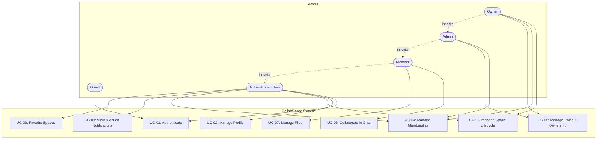

---

## UC-01: Authenticate (Detailed)

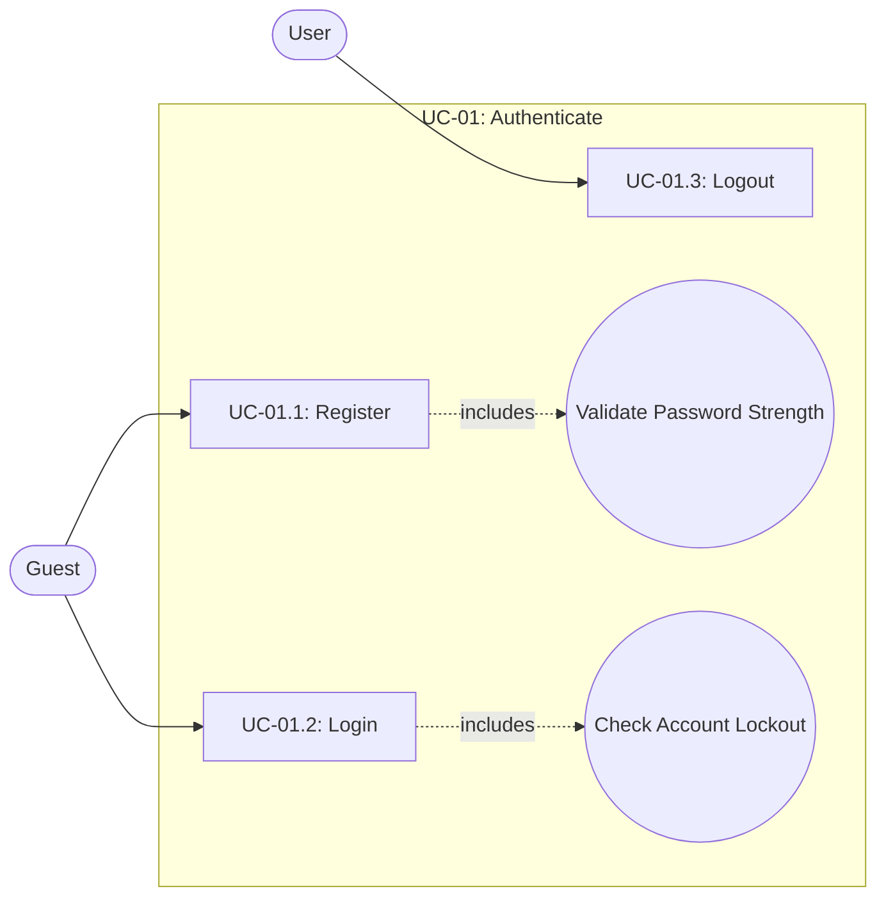

---

## UC-02: Manage Profile (Detailed)

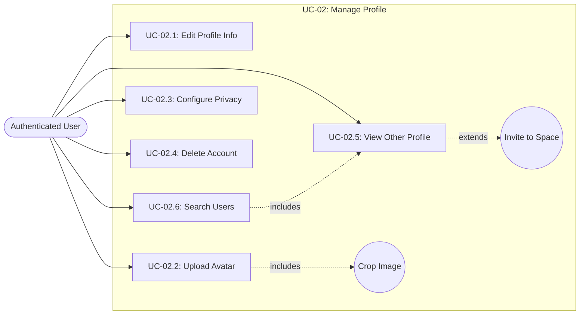

---

## UC-03: Manage Space Lifecycle (Detailed)

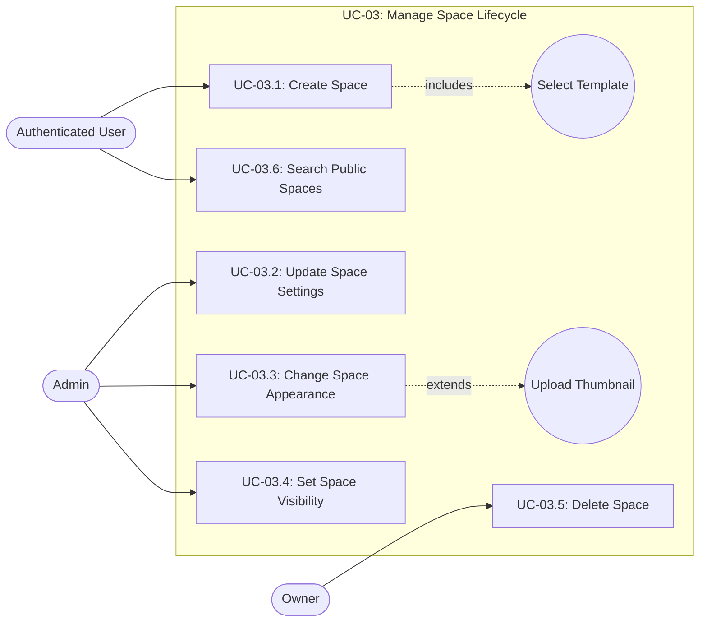

---

## UC-04: Manage Membership (Detailed)

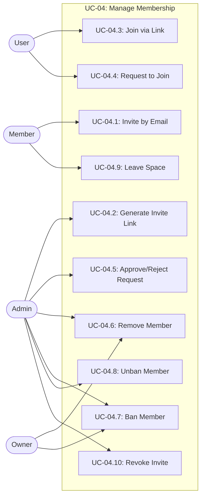

---

## UC-05: Manage Roles & Ownership (Detailed)

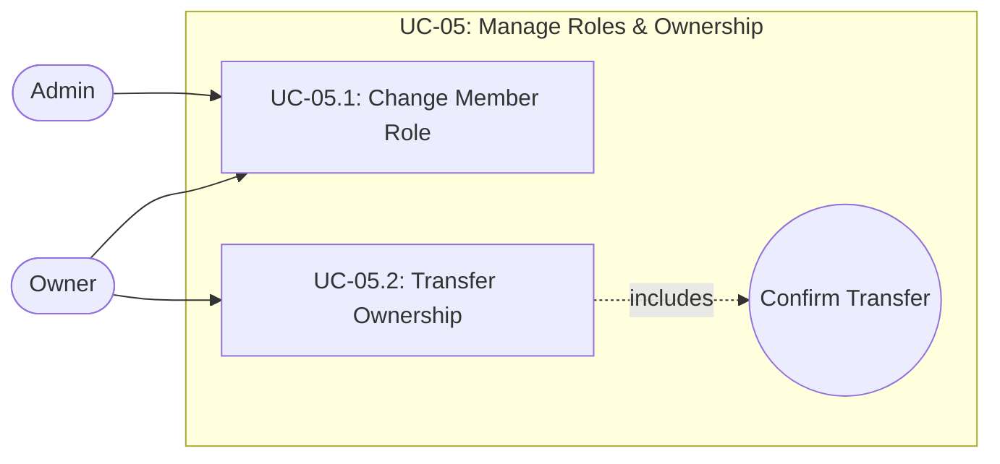

---

## UC-06: Collaborate in Chat (Detailed)

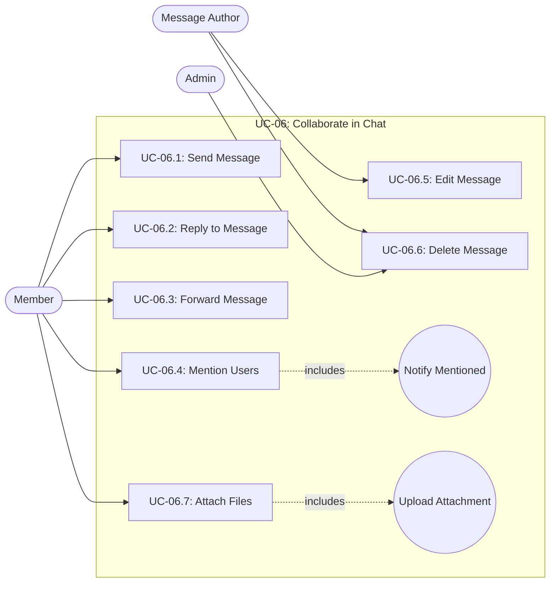

---

## UC-07: Manage Files (Detailed)

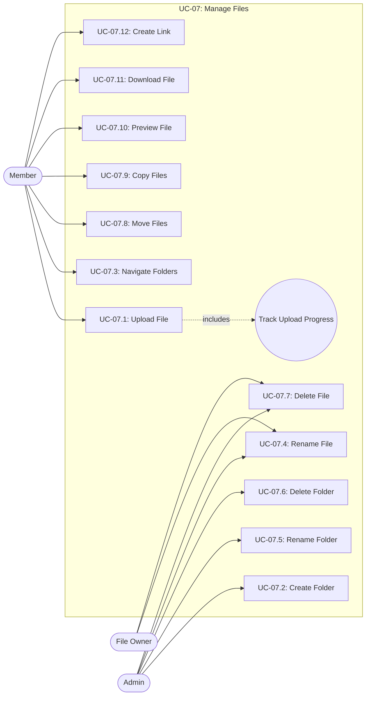

---

## UC-08: View & Act on Notifications (Detailed)

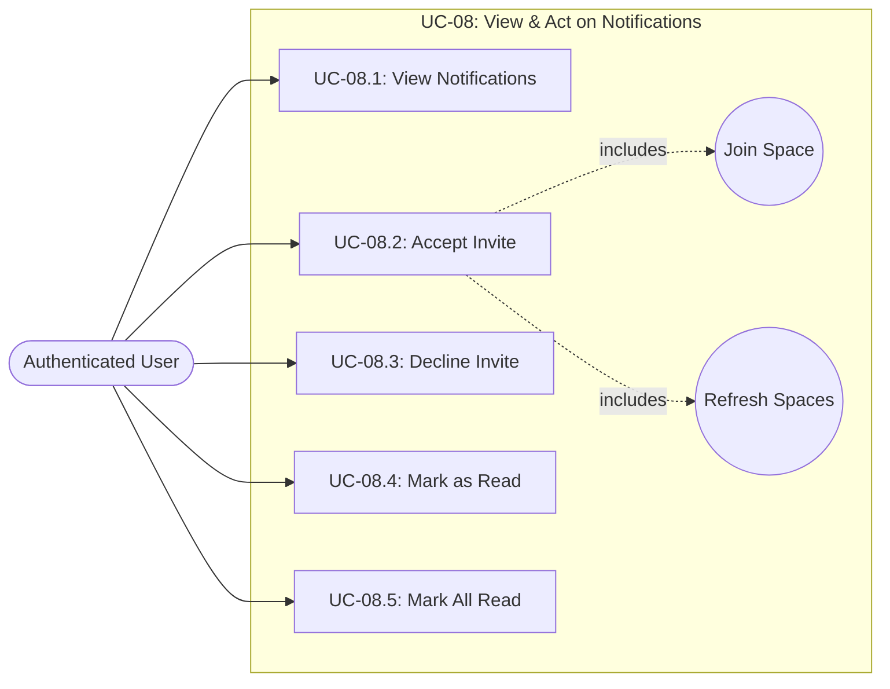

---

## UC-09: Favorite Spaces (Detailed)

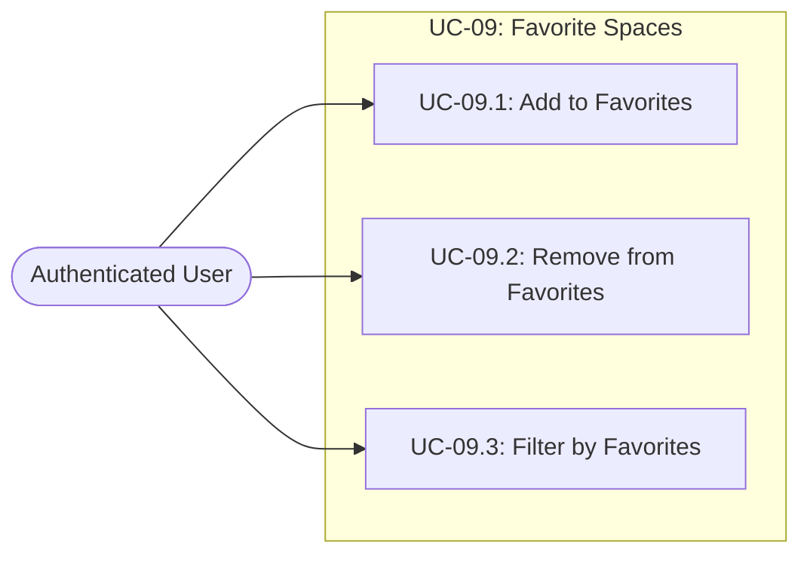

---

## Actor Hierarchy

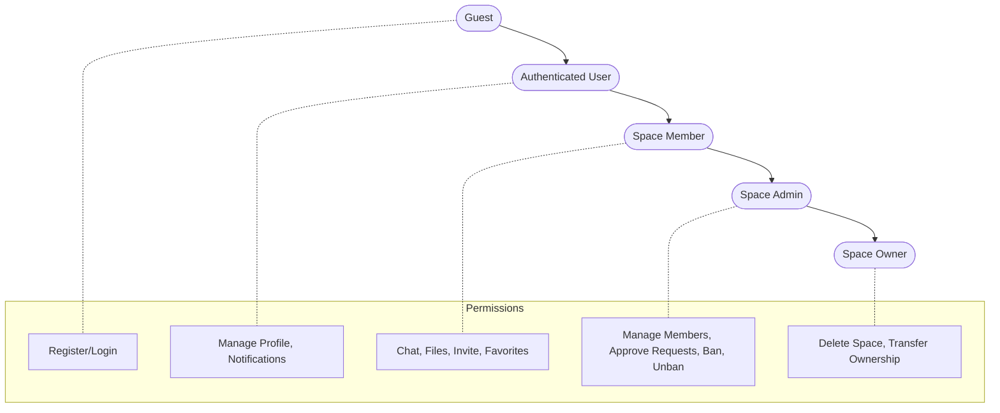

---

## Relationship Legend

| Symbol                 | Meaning                                 |
| ---------------------- | --------------------------------------- |
| `─────>`               | Actor performs use case                 |
| `-.->` with "includes" | Use case always includes another        |
| `-.->` with "extends"  | Use case optionally extends another     |
| `-.->` with "inherits" | Actor inherits permissions from another |
| `(( ))`                | Included/Extended sub-function          |
| `[ ]`                  | Use case                                |
| `([ ])`                | Actor                                   |
